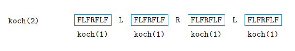

<div><center>Table of Contents</center></div>

- [[#2.1 Expressions, Variables, and Assignments|2.1 Expressions, Variables, and Assignments]]
	- [[#2.1 Expressions, Variables, and Assignments#1. Algebraic Expressions and Functions|1. Algebraic Expressions and Functions]]
	- [[#2.1 Expressions, Variables, and Assignments#2. Boolean Expressions and Operators|2. Boolean Expressions and Operators]]
		- [[#2. Boolean Expressions and Operators#and|and]]
		- [[#2. Boolean Expressions and Operators#or|or]]
		- [[#2. Boolean Expressions and Operators#not|not]]
	- [[#2.1 Expressions, Variables, and Assignments#3. Variables and Assignment|3. Variables and Assignment]]
- [[#2.2 Strings|2.2 Strings]]
	- [[#2.2 Strings#1. String Operators|1. String Operators]]
	- [[#2.2 Strings#2. Indexing Operator|2. Indexing Operator]]
- [[#2.3 Lists and Tuples|2.3 Lists and Tuples]]
	- [[#2.3 Lists and Tuples#1. List Operators|1. List Operators]]
	- [[#2.3 Lists and Tuples#2. Tuples|2. Tuples]]
	- [[#2.3 Lists and Tuples#3. List and Tuple Methods|3. List and Tuple Methods]]
- [[#2.4 Objects and Classes|2.4 Objects and Classes]]
	- [[#2.4 Objects and Classes#1. Operator Precedence|1. Operator Precedence]]
	- [[#2.4 Objects and Classes#2. Implicit Type Conversions(隐式转换)|2. Implicit Type Conversions(隐式转换)]]
	- [[#2.4 Objects and Classes#3. Explicit Type Conversions(显性转换)|3. Explicit Type Conversions(显性转换)]]
	- [[#2.4 Objects and Classes#4. Class Methods and Object-Oriented Programming(OOP)(类方法和面向对象编程(OOP))|4. Class Methods and Object-Oriented Programming(OOP)(类方法和面向对象编程(OOP))]]
- [[#2.5 Python Standard Library|2.5 Python Standard Library]]
- [[#3.1 Python Programs|3.1 Python Programs]]
		- [[#4. Class Methods and Object-Oriented Programming(OOP)(类方法和面向对象编程(OOP))#1. Build-in Function: `print()`|1. Build-in Function: `print()`]]
		- [[#4. Class Methods and Object-Oriented Programming(OOP)(类方法和面向对象编程(OOP))#2. Interactive Input with `input()`|2. Interactive Input with `input()`]]
- [[#3.2 Execution Control Structures (执行控制结构)|3.2 Execution Control Structures (执行控制结构)]]
	- [[#3.2 Execution Control Structures (执行控制结构)#1. One-Way Decisions (单项决策)|1. One-Way Decisions (单项决策)]]
	- [[#3.2 Execution Control Structures (执行控制结构)#2. Two-Way Decisions (双向决策)|2. Two-Way Decisions (双向决策)]]
	- [[#3.2 Execution Control Structures (执行控制结构)#3. Iteration Structures (迭代结构)|3. Iteration Structures (迭代结构)]]
	- [[#3.2 Execution Control Structures (执行控制结构)#4. Nesting Control Flow Structures (嵌套控制流结构)|4. Nesting Control Flow Structures (嵌套控制流结构)]]
	- [[#3.2 Execution Control Structures (执行控制结构)#5. Function `range()`|5. Function `range()`]]
- [[#3.3 User-Defined Function|3.3 User-Defined Function]]
	- [[#3.3 User-Defined Function#1. ...就是自己定义一个函数然后在shell中去run一下...|1. ...就是自己定义一个函数然后在shell中去run一下...]]
	- [[#3.3 User-Defined Function#2. `print()` versus `return`|2. `print()` versus `return`]]
	- [[#3.3 User-Defined Function#3. ~~Function Definitions Are “Assignment” Statements~~|3. ~~Function Definitions Are “Assignment” Statements~~]]
- [[#3.4 Python Variables and Assignments (变量与定义)|3.4 Python Variables and Assignments (变量与定义)]]
		- [[#3. ~~Function Definitions Are “Assignment” Statements~~#1. Mutable and Immutable Types (可变与不可变类型)|1. Mutable and Immutable Types (可变与不可变类型)]]
		- [[#3. ~~Function Definitions Are “Assignment” Statements~~#2. Assignments and Mutability (赋值与可变性)|2. Assignments and Mutability (赋值与可变性)]]
- [[#3.5 Parameter Passing (参数传递)|3.5 Parameter Passing (参数传递)]]
		- [[#3. ~~Function Definitions Are “Assignment” Statements~~#1. Immutable Parameter Passing(不可变参数的传递)|1. Immutable Parameter Passing(不可变参数的传递)]]
		- [[#3. ~~Function Definitions Are “Assignment” Statements~~#2. Mutable Parameter Passing(可变参数的传递)|2. Mutable Parameter Passing(可变参数的传递)]]
- [[#4.1: Strings, Revisited|4.1: Strings, Revisited]]
	- [[#4.1: Strings, Revisited#1. String Representations|1. String Representations]]
	- [[#4.1: Strings, Revisited#2. The Indexing Operator, Revisited|2. The Indexing Operator, Revisited]]
	- [[#4.1: Strings, Revisited#3. String Methods|3. String Methods]]
		- [[#3. String Methods#a) `.find()`|a) `.find()`]]
		- [[#3. String Methods#b) `.count()`|b) `.count()`]]
		- [[#3. String Methods#c) `.replace()`|c) `.replace()`]]
		- [[#3. String Methods#d) `.capitalize()` & `.upper()`|d) `.capitalize()` & `.upper()`]]
		- [[#3. String Methods#e) `.split()`|e) `.split()`]]
		- [[#3. String Methods#f) `.translate()`|f) `.translate()`]]
		- [[#3. String Methods#SUMMARY|SUMMARY]]
- [[#4.2: Formatted Outpu|4.2: Formatted Outpu]]
	- [[#4.2: Formatted Outpu#1. Function `print()`|1. Function `print()`]]
	- [[#4.2: Formatted Outpu#2. ~~String Method format()~~|2. ~~String Method format()~~]]
- [[#4.3 Files|4.3 Files]]
	- [[#4.3 Files#1. File System|1. File System]]
	- [[#4.3 Files#2. Opening and Closing a File|2. Opening and Closing a File]]
	- [[#4.3 Files#2. Patterns for Reading a Text File|2. Patterns for Reading a Text File]]
	- [[#4.3 Files#3. ~~Writing to a Text File~~|3. ~~Writing to a Text File~~]]
- [[#4.4 Errors and Exceptions|4.4 Errors and Exceptions]]
	- [[#4.4 Errors and Exceptions#1. Syntax Errors(语法错误)|1. Syntax Errors(语法错误)]]
	- [[#4.4 Errors and Exceptions#2. Built-In Exceptions(内置异常)|2. Built-In Exceptions(内置异常)]]
	- [[#4.4 Errors and Exceptions#SUMMARY|SUMMARY]]
- [[#5.1 Decision Control and the `if` Statement|5.1 Decision Control and the `if` Statement]]
	- [[#5.1 Decision Control and the `if` Statement#a) One-Way decision format:|a) One-Way decision format:]]
	- [[#5.1 Decision Control and the `if` Statement#b) Two-Way decision format:|b) Two-Way decision format:]]
	- [[#5.1 Decision Control and the `if` Statement#c) Three-Way (and More!) Decisions|c) Three-Way (and More!) Decisions]]
- [[#5.2 `for` loop and Iteration Patterns(for循环和迭代模式)|5.2 `for` loop and Iteration Patterns(for循环和迭代模式)]]
	- [[#5.2 `for` loop and Iteration Patterns(for循环和迭代模式)#1. Loop Pattern: Iteration Loop(迭代循环)|1. Loop Pattern: Iteration Loop(迭代循环)]]
	- [[#5.2 `for` loop and Iteration Patterns(for循环和迭代模式)#2. Loop Pattern: Counter Loop(计数器循环)|2. Loop Pattern: Counter Loop(计数器循环)]]
	- [[#5.2 `for` loop and Iteration Patterns(for循环和迭代模式)#3. Loop Pattern: Accumulator Loop(累加器循环)|3. Loop Pattern: Accumulator Loop(累加器循环)]]
	- [[#5.2 `for` loop and Iteration Patterns(for循环和迭代模式)#4. Accumulating Different Types(混合类型累加)|4. Accumulating Different Types(混合类型累加)]]
	- [[#5.2 `for` loop and Iteration Patterns(for循环和迭代模式)#5. Loop Patterns: Nested Loop(嵌套循环)|5. Loop Patterns: Nested Loop(嵌套循环)]]
- [[#5.3 More on Lists: Two-Dimensional Lists|5.3 More on Lists: Two-Dimensional Lists]]
	- [[#5.3 More on Lists: Two-Dimensional Lists#1. Two-Dimensional Lists(二维列表)|1. Two-Dimensional Lists(二维列表)]]
	- [[#5.3 More on Lists: Two-Dimensional Lists#2. Two-Dimensional Lists and the Nested Loop Pattern(二维列表和嵌套循环)|2. Two-Dimensional Lists and the Nested Loop Pattern(二维列表和嵌套循环)]]
- [[#5.4 `While` Loop|5.4 `While` Loop]]
- [[#5.5 More Loop Patterns|5.5 More Loop Patterns]]
	- [[#5.5 More Loop Patterns#1. Iteration Patterns: Sequence Loop(迭代模式：串行循环)|1. Iteration Patterns: Sequence Loop(迭代模式：串行循环)]]
		- [[#1. Iteration Patterns: Sequence Loop(迭代模式：串行循环)#a) Fibonacci Numbers|a) Fibonacci Numbers]]
		- [[#1. Iteration Patterns: Sequence Loop(迭代模式：串行循环)#b) Approximate to e|b) Approximate to e]]
		- [[#1. Iteration Patterns: Sequence Loop(迭代模式：串行循环)#c) Loop Pattern: Infinite Loop(无限循环)|c) Loop Pattern: Infinite Loop(无限循环)]]
		- [[#1. Iteration Patterns: Sequence Loop(迭代模式：串行循环)#d) Loop Pattern: Loop and a Half(半循环)|d) Loop Pattern: Loop and a Half(半循环)]]
- [[#5.6 Additional Iteration Control Statement(附加：迭代与控制语句)|5.6 Additional Iteration Control Statement(附加：迭代与控制语句)]]
	- [[#5.6 Additional Iteration Control Statement(附加：迭代与控制语句)#1. ~~break~~|1. ~~break~~]]
	- [[#5.6 Additional Iteration Control Statement(附加：迭代与控制语句)#2. ~~continue~~|2. ~~continue~~]]
	- [[#5.6 Additional Iteration Control Statement(附加：迭代与控制语句)#3. pass|3. pass]]
- [[#6.1: Dictionaries(字典)|6.1: Dictionaries(字典)]]
	- [[#6.1: Dictionaries(字典)#1. User-Defined Indexes as Motivation for Dictionaries(用户索引作为字典)|1. User-Defined Indexes as Motivation for Dictionaries(用户索引作为字典)]]
	- [[#6.1: Dictionaries(字典)#2. Dictionary Class Properties(属性)|2. Dictionary Class Properties(属性)]]
	- [[#6.1: Dictionaries(字典)#3. Dictionary Operators|3. Dictionary Operators]]
	- [[#6.1: Dictionaries(字典)#4. Dictionary Methods|4. Dictionary Methods]]
		- [[#4. Dictionary Methods#`pop()`|`pop()`]]
		- [[#4. Dictionary Methods#`update()`|`update()`]]
		- [[#4. Dictionary Methods#`keys()`, `values()`, and `items()`|`keys()`, `values()`, and `items()`]]
	- [[#6.1: Dictionaries(字典)#5. A Dictionary as a Substitute for the Multiway if Statement (字典代替多重if判断)|5. A Dictionary as a Substitute for the Multiway if Statement (字典代替多重if判断)]]
	- [[#6.1: Dictionaries(字典)#6. Dictionary as a Collection of Counters|6. Dictionary as a Collection of Counters]]
	- [[#6.1: Dictionaries(字典)#7. `tuple` Objects Can Be Dictionary Keys (元组对象可以作为字典的键)|7. `tuple` Objects Can Be Dictionary Keys (元组对象可以作为字典的键)]]
- [[#6.2:`Set` (集合)|6.2:`Set` (集合)]]
	- [[#6.2:`Set` (集合)#1. Using the `set` Constructor to Remove Duplicates (用set构造函数去重)|1. Using the `set` Constructor to Remove Duplicates (用set构造函数去重)]]
	- [[#6.2:`Set` (集合)#2. `set` Operators (集合方法)|2. `set` Operators (集合方法)]]
- [[#6.3 Character Encodings and Strings (字符编码和字符串)|6.3 Character Encodings and Strings (字符编码和字符串)]]
	- [[#6.3 Character Encodings and Strings (字符编码和字符串)#2. UTF-8 Encoding for Unicode Characters (UTF-8 编码和Unicode编码)|2. UTF-8 Encoding for Unicode Characters (UTF-8 编码和Unicode编码)]]
- [[#6.4 Module `random`|6.4 Module `random`]]
	- [[#6.4 Module `random`#1. Choosing a Random Integer|1. Choosing a Random Integer]]
	- [[#6.4 Module `random`#2. Choosing a Random "Real"|2. Choosing a Random "Real"]]
	- [[#6.4 Module `random`#3. Shuffling, Choosing, and Sampling at Random (随机取样)|3. Shuffling, Choosing, and Sampling at Random (随机取样)]]
		- [[#3. Shuffling, Choosing, and Sampling at Random (随机取样)#`shuffle()`|`shuffle()`]]
		- [[#3. Shuffling, Choosing, and Sampling at Random (随机取样)#`choice()`|`choice()`]]
		- [[#3. Shuffling, Choosing, and Sampling at Random (随机取样)#`sample()`|`sample()`]]
- [[#7.1:  Encapsulation in Functions (封装)|7.1:  Encapsulation in Functions (封装)]]
	- [[#7.1:  Encapsulation in Functions (封装)#1. Code Reuse (代码复用)|1. Code Reuse (代码复用)]]
	- [[#7.1:  Encapsulation in Functions (封装)#2. Modularity (模块化)|2. Modularity (模块化)]]
	- [[#7.1:  Encapsulation in Functions (封装)#3. Encapsulation (or Information Hiding) (封装)|3. Encapsulation (or Information Hiding) (封装)]]
	- [[#7.1:  Encapsulation in Functions (封装)#4. Local Variables (局部变量)|4. Local Variables (局部变量)]]
	- [[#7.1:  Encapsulation in Functions (封装)#5. Namespaces Associated with Function Calls (与函数调用关联的命名空间)|5. Namespaces Associated with Function Calls (与函数调用关联的命名空间)]]
	- [[#7.1:  Encapsulation in Functions (封装)#6. Namespaces and the Program Stack (命名空间和进程堆栈)|6. Namespaces and the Program Stack (命名空间和进程堆栈)]]
- [[#7.2: Global versus Local Namespaces (全局变量和局部变量)|7.2: Global versus Local Namespaces (全局变量和局部变量)]]
	- [[#7.2: Global versus Local Namespaces (全局变量和局部变量)#1. Global Variables|1. Global Variables]]
	- [[#7.2: Global versus Local Namespaces (全局变量和局部变量)#2. Variables with Local Scope (局部作用域的变量)|2. Variables with Local Scope (局部作用域的变量)]]
	- [[#7.2: Global versus Local Namespaces (全局变量和局部变量)#3. Variables with Global Scope (全局作用域的变量)|3. Variables with Global Scope (全局作用域的变量)]]
	- [[#7.2: Global versus Local Namespaces (全局变量和局部变量)#4. Changing Global Variables Inside a Function (函数内部改变全局变量)|4. Changing Global Variables Inside a Function (函数内部改变全局变量)]]
- [[#7.3: Exceptional Control Flow (异常控制流)|7.3: Exceptional Control Flow (异常控制流)]]
	- [[#7.3: Exceptional Control Flow (异常控制流)#1. Exceptions and Exceptional Control Flow (异常与异常控制流)|1. Exceptions and Exceptional Control Flow (异常与异常控制流)]]
	- [[#7.3: Exceptional Control Flow (异常控制流)#2. Catching and Handling Exceptions (捕获并处理异常)|2. Catching and Handling Exceptions (捕获并处理异常)]]
	- [[#7.3: Exceptional Control Flow (异常控制流)#3. The Default Exception Handler (默认异常处理)|3. The Default Exception Handler (默认异常处理)]]
	- [[#7.3: Exceptional Control Flow (异常控制流)#4. Catching Exceptions of a Given Type (捕获指定类型的异常)|4. Catching Exceptions of a Given Type (捕获指定类型的异常)]]
	- [[#7.3: Exceptional Control Flow (异常控制流)#5. Multiple Exception Handlers (多重异常处理)|5. Multiple Exception Handlers (多重异常处理)]]
	- [[#7.3: Exceptional Control Flow (异常控制流)#6. Controlling the exceptional Control Flow|6. Controlling the exceptional Control Flow]]
- [[#*7.4 Modules as Namespaces (模块命名空间)|*7.4 Modules as Namespaces (模块命名空间)]]
	- [[#*7.4 Modules as Namespaces (模块命名空间)#1. Module Search Path (模块搜索路径)|1. Module Search Path (模块搜索路径)]]
	- [[#*7.4 Modules as Namespaces (模块命名空间)#2. Top-Level Module (顶层模块)|2. Top-Level Module (顶层模块)]]
	- [[#*7.4 Modules as Namespaces (模块命名空间)#3. Different Ways to Import Module Attributes|3. Different Ways to Import Module Attributes]]
		- [[#3. Different Ways to Import Module Attributes#a`import` 整个模块导入|a`import` 整个模块导入]]
		- [[#3. Different Ways to Import Module Attributes#b `from Module import attribute`模块属性导入|b `from Module import attribute`模块属性导入]]
		- [[#3. Different Ways to Import Module Attributes#c `from Module import *` 引入全部属性|c `from Module import *` 引入全部属性]]
- [[#*7.5 Classes as Namespaces|*7.5 Classes as Namespaces]]
	- [[#*7.5 Classes as Namespaces#1. A Class Is a Namespace|1. A Class Is a Namespace]]
	- [[#*7.5 Classes as Namespaces#2. Class Methods Are Functions Defined in the Class Namespace|2. Class Methods Are Functions Defined in the Class Namespace]]
- [[#8.1 Defining a New Python Class|8.1 Defining a New Python Class]]
	- [[#8.1 Defining a New Python Class#1. Methods of Class `Point`|1. Methods of Class `Point`]]
	- [[#8.1 Defining a New Python Class#2. A Class and Its Namespace (类和他的命名空间)|2. A Class and Its Namespace (类和他的命名空间)]]
	- [[#8.1 Defining a New Python Class#3. Every Object Has an Associated Namespace (每个对象都有对应的命名空间)|3. Every Object Has an Associated Namespace (每个对象都有对应的命名空间)]]
	- [[#8.1 Defining a New Python Class#4. Instance Variables (实例化)|4. Instance Variables (实例化)]]
	- [[#8.1 Defining a New Python Class#5. Instances Inherit Class Attributes (实例继承类属性)|5. Instances Inherit Class Attributes (实例继承类属性)]]
	- [[#8.1 Defining a New Python Class#6. Class Definition, More Generally (一般类的定义)|6. Class Definition, More Generally (一般类的定义)]]
- [[#8.2 Examples of User-Defined Classes (自定义类的样例)|8.2 Examples of User-Defined Classes (自定义类的样例)]]
	- [[#8.2 Examples of User-Defined Classes (自定义类的样例)#1. Overloaded Constructor Operator (重载构造运算符)|1. Overloaded Constructor Operator (重载构造运算符)]]
	- [[#8.2 Examples of User-Defined Classes (自定义类的样例)#2. Default Constructor (默认构造函数)|2. Default Constructor (默认构造函数)]]
	- [[#8.2 Examples of User-Defined Classes (自定义类的样例)#3. Implementing the `Deck(of Cards)` Class|3. Implementing the `Deck(of Cards)` Class]]
- [[#8.4 Overloaded Operators (复写运算符)|8.4 Overloaded Operators (复写运算符)]]
	- [[#8.4 Overloaded Operators (复写运算符)#1. Operators Are Class Methods (类的运算符)|1. Operators Are Class Methods (类的运算符)]]
	- [[#8.4 Overloaded Operators (复写运算符)#2. Overloaded Operators|2. Overloaded Operators]]
	- [[#8.4 Overloaded Operators (复写运算符)#3. Contract between the Constructor and the `repr()` Operator (构造函数和`repr()`方法之间的规定)|3. Contract between the Constructor and the `repr()` Operator (构造函数和`repr()`方法之间的规定)]]
	- [[#8.4 Overloaded Operators (复写运算符)#4. 完善`Queue`类|4. 完善`Queue`类]]
- [[#8.5 Inheritance (继承)|8.5 Inheritance (继承)]]
	- [[#8.5 Inheritance (继承)#1. Inheriting Attributes of a Class (类的继承)|1. Inheriting Attributes of a Class (类的继承)]]
	- [[#8.5 Inheritance (继承)#2. Class Definition, in General (通用类定义)|2. Class Definition, in General (通用类定义)]]
	- [[#8.5 Inheritance (继承)#3. Overriding Superclass Methods (复写)|3. Overriding Superclass Methods (复写)]]
	- [[#8.5 Inheritance (继承)#4. Extending Superclass Methods (扩展)|4. Extending Superclass Methods (扩展)]]
	- [[#8.5 Inheritance (继承)#5. Implementing a Queue Class by Inheriting from `list`|5. Implementing a Queue Class by Inheriting from `list`]]
- [[#~~Section 8.6~~|~~Section 8.6~~]]
- [[#10.1 Introduction|10.1 Introduction]]
	- [[#10.1 Introduction#1. Functions that Call Themselves (调用自身)|1. Functions that Call Themselves (调用自身)]]
	- [[#10.1 Introduction#2. Stopping Condition|2. Stopping Condition]]
	- [[#10.1 Introduction#3. Properties of Recursive Functions (性质)|3. Properties of Recursive Functions (性质)]]
		- [[#3. Properties of Recursive Functions (性质)#4. Recursive Thinking (递归思维)|4. Recursive Thinking (递归思维)]]
- [[#10.2 Examples of Recursion (例子)|10.2 Examples of Recursion (例子)]]
	- [[#10.2 Examples of Recursion (例子)#1. Fractals (分型)|1. Fractals (分型)]]
	- [[#10.2 Examples of Recursion (例子)#2. Virus Scanner (病毒扫描)|2. Virus Scanner (病毒扫描)]]
	- [[#10.2 Examples of Recursion (例子)#3. Linear Recursion (线性递归)|3. Linear Recursion (线性递归)]]
- [[#Run Time Analysis (运行时间分析)|Run Time Analysis (运行时间分析)]]
	- [[#Run Time Analysis (运行时间分析)#1. The Exponent Function （指数）|1. The Exponent Function （指数）]]
	- [[#Run Time Analysis (运行时间分析)#2. Counting Operations|2. Counting Operations]]
	- [[#Run Time Analysis (运行时间分析)#3. Fibonacci Sequence (斐波那契数列)|3. Fibonacci Sequence (斐波那契数列)]]


# Chapter 1:Introduction to Computer Science

<div><center>N/A</center></div>

# Chapter 2:Python Data Types

**ALL**

## 2.1 Expressions, Variables, and Assignments

### 1. Algebraic Expressions and Functions

```python
>>> 3+7
```

hit the <kbd>Enter</kbd> key on the keyboard to view result of evaluating the expression:

```python
10
```

So, let's try expressions that use different algebraic operators:

```python
>>> 3 * 2
6
>>> 5 / 2
2.5
>>> 4 / 2
2.0
```

tips: in the third expression, an integer is divided by another and the result is shown in <u>decimal point notation(小数形式)</u>. This is because when an integer is divided by another,the result is not necessarily an integer. The rule in Python is return a number with a decimal point and a fractional part, even when the result is an integer. `(Perkovic, 2005, p. 16)`

Number without the decimal point are said to be of *type integer* or simply *int*. Values with decimal points and fractional parts are said to be of type *floating point* or simply *float*.

**ATTENTION:** The standard algebra *precedence rules* apply in python: ==Multiplication and division take precedence over addition and subtraction, parentheses are used when we want to explicitly specify the order in which operations should take place.== If all else fails, expressions are evaluated from using the `left-to-right evaluation` rule. This last rule is used in the next expression, where the addition is executed **after** the subtraction

When two int values are added(+), subtracted(-), or multiplied(*), the result is an int value. if at least one float value appears in the expression, however, **the result is always a float value**. Note that a float value is also obtained when two integer values are divided.

**Exponentiation Operator**

```python
>>>2**3
8
>>>2**4
16
```

**Integer Quotient & Remainder**

The `//` operator in expression `a//b` returns the integer quotient (The result's type is `int`). The `%` operator in expression `a%b` computes the remainder (The result's type is `int`).

```python
>>>14//3
4
>>>14%3
2
>>>type(14//3)
<class 'int'>
>>>type(14%3)
<class 'int'>
```

**Absolute, Max, and Min**

```python
import math
abs(-4) #4
abs(3) #4, integer type
abs(3.2) #3.2, floating point

min(6,-2) #-2
max(6,-2) #6
min(2, -4, 6, -2) #-4
max(12, 26.5, 3.5) #26.5
```

### 2. Boolean Expressions and Operators

#### and

|   p   |   q   | p and q |
| :---: | :---: | :-----: |
| true  | true  |  true   |
| true  | false |  false  |
| false | true  |  false  |
| false | false |  false  |

#### or

|   p   |   q   | p or q |
| :---: | :---: | ------ |
| true  | true  | true   |
| true  | false | true   |
| false | true  | true   |
| false | false | false  |

#### not

|   p   | not p |
| :---: | :---: |
| true  | false |
| false | true  |

### 3. Variables and Assignment

in Python, a value can be assigned to a variable:

```python
>>>x = 4
# <cariable> = <expression>
>>>x
4
```

**CAUTION**: Be careful to distinguish the assignment statement `=` and the equality operator `==`.

**About Variables' Name**: The characters making up a variable name can be lowercase and uppercase letters from the alphabet (a through z and A through Z), the underscore character (_), and, except for the first character, digits 0 through 9.

The names below are used as reserved keywords of the Python language. You cannot use them other than as Python commands:

| False  | break    | else    | if       | not    | while |
| ------ | -------- | ------- | -------- | ------ | ----- |
| None   | class    | except  | import   | or     | with  |
| True   | continue | finally | in       | pass   | yield |
| and    | def      | for     | is       | raise  |       |
| as     | del      | from    | lambda   | return |       |
| assert | elif     | global  | nonlocal | try    |       |

## 2.2 Strings

The Python string type, denoted str, is used to represent and manipulate text data or, in other words, a sequence of characters, including blanks, punctuation, and various symbols. A string value is represented as a sequence of characters that is enclosed within quotes:

```python
>>> 'Hello, World!'
'Hello, World!'
>>> s = 'hello'
>>> s
'hello'
```

### 1. String Operators

Like numbers, strings can be compared using comparison operators: ==, !=, < , >, and so on. Operator ==, for example, returns True if the strings on either side of the operator have the same value:

```python
>>> s == 'hello'
True
>>> t = 'world'
>>> s != t
True
>>> s == t
False
```

The + operator, when applied to two strings, evaluates to a new string that is the concatenation (i.e., the joining) of the two strings:

```python
>>> s + t
'helloworld'
>>> s + ' ' + t
'hello world'
```

| Usage          | Explanation                                                  |
| -------------- | ------------------------------------------------------------ |
| `x in s`       | True if string x is a substring of string s, and false otherwise |
| `x not in s`   | False if string x is a substring of string s, and true otherwise |
| `s + t`        | Concatenation of string s and string t                       |
| `s * n, n * s` | Concatenation of n copies of s                               |
| `s[i]`         | Character of string s at index i                             |
| `len(s)`       | Length of string s                                           |

**`len()`** function returns the length of the string `(string)->(int)`

### 2. Indexing Operator

The individual characters of a string can be accessed using the indexing operator `[]`.

```python
>>>s = 'Hello'
>>> s[0]
'h'
>>> s[1]
'e'
>>> s[4]
'o'
```

**The string index and index operator** (字符串索引和索引运算符)


**Index operator using negative indexes** (字符串的反向索引)


## 2.3 Lists and Tuples

列表和元组

Assignment example

```python
>>> pets = ['goldfish', 'cat', 'dog']
# The variable pets evaluates to the list:
>>> pets
['goldfish', 'cat', 'dog']
```

In Python, a list is represented as a comma-separated sequence of objects enclosed within
square brackets. An empty list is represented as []. Lists can contain items of different
types. For example, the list named things in

```python
>>>things = ['one', 2, [3, 4]]
```

has three items: the first is string 'one', the second is integer 2, and the third item is list [3, 4].

### 1. List Operators

the items in the list may be accessed individually using the
indexing operator, just as individual characters can be accessed in a string:
```python
>>> pets[0]
>>> 'goldfish'
>>> pets[2]
>>> 'dog'
```
Figure 2.3 illustrates the list pets along with the indexing of the list items. Negative indexes can be used too:
```python
>>> pets[-1]
>>> 'dog'
```


**List operators and functions**: 

| Usage                | Explanation                                          |
| -------------------- | ---------------------------------------------------- |
| `x in lst`           | True if object `x` is in list `lst`, false otherwise |
| `x not in lst`       | False if object `x` is in list `lst`, true otherwise |
| `lstA + lstB`        | Concatenation of lists `lstA` and `lstB`             |
| `lst * n`, `n * lst` | Concatenation of `n` copies of list `lst`            |
| `lst[i]`             | Item at index `i` of list `lst`                      |
| `len(lst)`           | Length of list `lst`                                 |
| `min(lst)`           | Smallest item in list `lst`                          |
| `max(lst)`           | Largest item in list `lst`                           |
| `sum(lst)`           | Sum of items in list `lst`                           |

```python
>>>len(pets)
3
>>>pets + pets
['goldfish', 'cat', 'dog', 'goldfish', 'cat', 'dog']
>>> pets * 2
['goldfish', 'cat', 'dog', 'goldfish', 'cat', 'dog']

>>> 'rabbit' in pets
False
>>> 'dog' in pets
True

>>> lst = [23.99, 19.99, 34.50, 120.99]
>>> min(lst)
19.99
>>> max(lst)
120.99
>>> sum(lst)
199.46999999999997
```

**ATTENTION: Lists Are Mutable, Strings Are Not**

For example: you can change the index of the object in the list, just like you change the 1st index of element in the list:

```python
>>> pets[1] = 'cymric cat'
>>> pets
['goldfish', 'cymric cat', 'dog']
```

However, you can't change any elements in the string:
We would like to correct the mistake by changing the character at index 7 from a 'b' to a

```python
>>> myCat = 'cymric bat'
'c'. Let’s try:
>>> myCat[7] = 'c'
    Traceback (most recent call last):
    File "<pyshell#35>", line 1, in <module>
    myCat[7] = 'c'
    TypeError: 'str' object does not support item assignment
```

if you want to change it, you will get a `TypeError` which will tell you `'str' object does not support item assignment`

### 2. Tuples

We also can call it "Immutable Lists"

A tuple object contains a sequence of values separated by commas and enclosed in parentheses`( )`instead of brackets `[ ]`:

```python
>>> days = ('Mo', 'Tu', 'We')
>>> days
('Mo', 'Tu', 'We')
```

The parentheses are optional in simple expressions like this assignment:

```python
>>> days = 'Mo', 'Tu', 'We', 'Th'
>>> days
('Mo', 'Tu', 'We', 'Th')
```

All the operators shown above in Lis can be used on tuples as well

**However, any attempt to change a tuple results in an error:**

```python
>>>days = 'mo','tu','the','thu','fri'
days[1] = 'sun'
Traceback (most recent call last):
  File "<pyshell#4>", line 1, in <module>
    days[1] = 'sun'
TypeError: 'tuple' object does not support item assignment
```

*注意：任何试图更改元组内容的操作都会被返回一个`TypeErroe`的报错，因为元组内容不可更改。区别于列表*

**CAUTION: One-Item Tuple**

If you need to create a one-item tuple, such as:

```python
>>>day = ('Mo')
>>>day
'Mo'
>>>type(day)
<class 'str'>
```

You will find this one-item tuple is a string type. What about an integer?

```python
>>>t = (3)
>>>t
3
>>>type(t)
<class 'int'>
```

The suitable reason is that: It's clear that the parentheses are as parentheses should be in an arithmetic expression. In face, the same was true when we evaluated`('Mo')`; while surrounding strings with parentheses may seem odd, the Python string operators `* `and `+ `do sometimes require us to use them to indicate the order in which string operations should be evaluated.

But how do we create a one element tuple? You can add a comma after the firs, and only item:

```python
>>>days = ('Mo',)
>>>days
('Mo',)
>>>type(days)
<class 'tuple'>
```

### 3. List and Tuple Methods

| Usage                     | Explanation                                                  |
| ------------------------- | ------------------------------------------------------------ |
| `lst.append(item)`        | Adds `item` to the end of list `lst`                         |
| `lst.count(item)`         | Returns the number of occurrences of `item` in list `lst`    |
| `lst.index(item)`         | Returns the index of the first occurrence of `item` in list `lst` |
| `lst.insert(index, item)` | Inserts `item` into list `lst` just before index `index`     |
| `lst.pop()`               | Removes last item in the list                                |
| `lst.remove(item)`        | Removes first occurrence of `item` in the list               |
| `lst.reverse()`           | Reverses the order of items in the list                      |
| `lst.sort()`              | Sorts the list                                               |

**PAY ATTENTION for their return values**

1. `lst.sprt()`:it changes the list immediately and returns `None`

```python
>>>l = [1,5,3,20,14,10]
>>>sort(l)
>>>l
[1, 3, 5, 10, 14, 20]
```

so if you are sorting the list and trying to assign to a variable, that variable is None type.

 ```python
 >>>l = [1,5,3,20,14,10]
 >>>a = l.sort()
 >>>a
 >>>l
 [1, 3, 5, 10, 14, 20]
 >>>type(a)
 <class 'NoneType'>
 ```

However, if you use `lst.sorted()` operator, you can use a variable to get it, cause it returns a new list. But it doesn't change the original list.

```python
>>>l = [1,5,3,20,14,10]
>>>l
[1, 5, 3, 20, 14, 10]
>>>a = sorted(l)
>>>a
[1, 3, 5, 10, 14, 20]
>>>l
[1, 5, 3, 20, 14, 10]
```

2. `lst.pop()` (it will delete the last item) will return the deleted item, but `lst.remove(item)` (it will delete the first item) returns None, it changes the list immediately.

## 2.4 Objects and Classes

The types we have seen so far include the integer(int), floating point (float), Boolean (bool), string(str), and list (list) types.

**CAUTION: Variables Do Not have a Type:**

It is important to note that a variable does not have a type. A variable is just a name. Only the object it refers to has a type.

| Operation | Description           | Type (if x and y are integers) |
| --------- | --------------------- | ------------------------------ |
| `x + y`   | Sum                   | Integer                        |
| `x - y`   | Difference            | Integer                        |
| `x * y`   | Product               | Integer                        |
| `x / y`   | Division              | Float                          |
| `x // y`  | Integer division      | Integer                        |
| `x % y`   | Remainder of `x // y` | Integer                        |
| `-x`      | Negative `x`          | Integer                        |
| `abs(x)`  | Absolute value of `x` | Integer                        |
| `x ** y`  | `x` to the power `y`  | Integer                        |

### 1. Operator Precedence

The order in which operators are evaluated is defined either explicitly using parentheses or implicitly using either the operator precedence rules or the left-to-right evaluation rule if the operators have the same precedence. The operator precedence rules in Python follow:

| Operator                                              | Description                                          |
| ----------------------------------------------------- | ---------------------------------------------------- |
| `[expressions...]`                                    | List definition                                      |
| `x[]`, `x[index:index]`                               | Indexing operator                                    |
| `**`                                                  | Exponentiation                                       |
| `+x`, `-x`                                            | Positive, negative signs                             |
| `*`, `/`, `//`, `%`                                   | Product, division, integer division, remainder       |
| `+`, `-`                                              | Addition, subtraction                                |
| `in`, `not in`, `<`, `<=`, `>`, `>=`, `<`, `!=`, `==` | Comparisons, including membership and identity tests |
| `not x`                                               | Boolean NOT                                          |
| `and`                                                 | Boolean AND                                          |
| `or`                                                  | Boolean OR                                           |

### 2. Implicit Type Conversions(隐式转换)


Boolean is contained in int. Boolean values `True` and `False` typically behave like values 1 and 0, respectively, in almost all contexts.

```python
>>>True + 5
6
# Boolean -> int
>>>6 + 0.35
6.35
# int -> float
```

### 3. Explicit Type Conversions(显性转换)

For example, the int() constructor creates an integer from a float input argument; it does so by ==removing== the fractional part of the argument:

```python
>>>int(3.4)
3
>>>int(-3.6)
-3
```

The float() constructor applied to an integer will change the representation to a floating
point one, unless an overflow occurs.

```python
>>>float(3)
3.0
```

**ATTENTION:** The conversion from string to a number type will work only if it makes sense (i.e., the string is a valid representation of a value of the type); otherwise it results in an error:

```python
>>> int('3.4')
Traceback (most recent call last):
File "<pyshell#123>", line 1, in <module>
int('3.4')
ValueError: invalid literal for int() with base 10: '3.4'
>>> float('3.4')
3.4
```

*字符串的强类型转换必须在内容符合要求的情况下才可以，否则会返回`ValueError`*

### 4. Class Methods and Object-Oriented Programming(OOP)(类方法和面向对象编程(OOP))

``o.m(x,y)``
means that method m is called on object o with inputs x and y. The method m should be a method of the class object o belongs to. Every operation done in Python is a method

## 2.5 Python Standard Library


More than 200 built-in modules together form the Python Standard Library. Each module in the Standard Library contains functions and classes to support application programming in a certain domain.

# Chapter 3: Imperative Programming

ALL (except "Function Definitions Are Assignment Statements") 

## 3.1 Python Programs

By using IDLE, you can code in the <kbd>New File</kbd>, and save it. Then you can press <kbd>F5</kbd> to run your program in the IDLE Shell. **ATTENTION:** once you change you code in the program, you need to run it to the Shell to restart it.

#### 1. Build-in Function: `print()`

没什么好说的。。。**ATTENTION**: Each `print()` statement "printed" its argument on a separate line.

#### 2. Interactive Input with `input()`

```python
x = input('Enter your name: ')
```

**ATTENTION:** Function `input()` returns a string:

```python
>>>x = input('Enter a number: ')
Enter a number: 5
>>>x
'5'
```

## 3.2 Execution Control Structures (执行控制结构)

### 1. One-Way Decisions (单项决策)

`if` statement

```python
temp = eval(input('Enter the current temperature: '))

if temp > 86:
    print('A')
    print('B')
...
```

The flowchart for program `oneWay`:


### 2. Two-Way Decisions (双向决策)

`if...else...`

```python
temp = eval(input('Enter the current temperature: '))

if temp > 86:
    print('It is hot!')
	print('Be sure to drink liquids.')
else:
    print('It is not hot.')
    print('Bring a jacket.')
print('Goodbye.')
```


***ATTENTION：**注意缩进对齐*

### 3. Iteration Structures (迭代结构)

1. `for` loop

**Iteration through a string.**

```python
name = Lena
for char in name:
    print(char)
```


**in each `for` loop: `char` is just a variable name**, it also could be any other name, e.g. animal, day, i, j, f, k and so on, choose what you want. The for loop statement will repeatedly assign characters of string name to variable char. If name is string 'Lena', char will first have value 'L', then 'e', then 'n', and finally 'a'. For each value of char, the indented print statement `print(char)` is executed.

In general, the `for` loop statement has this format:

```python
for <variable> in <sequence>:
    <indented code block>
<non-indented code block>
```

### 4. Nesting Control Flow Structures (嵌套控制流结构)

...就是`for`里面套`if`...然后逐个判断...

```python
phrase = input('Enter a phrase: ')

for c in phrase:
	if c in 'aeoiuAEIOU':
		print(c)
```

for every `c` in `phrase`, if `c` in `'aeoiuAEIOU'` is `True`, then `print(c)`, if False, go to next character.

### 5. Function `range()`

```python
for i in range(5):
    print(i)
    
0
1
2
3
4
```

the number n in `range()` means 0~n-1, totally 5 numbers if there is only number in the function `range()`. In other word: includes first number but not another

**ATTENTION:** function `range()` has three argument can be used:

<center><b>range(start, end, step)</b></center>

## 3.3 User-Defined Function

### 1. ...就是自己定义一个函数然后在shell中去run一下...

```python
def <function name> (<0 or more variables>):
	<indented function body>
```

### 2. `print()` versus `return`

**ACUTION:** Statement `return` versus Function `print()`

don't mix up `return` and `print()`, even they sometimes look like work in the same thing.

For example, if I define a function `f(x)`:

```python
def f(x):
    print(x**2 + 1)
```

and I implement this function:

```python
>>>f(2)
5
```

It looks ok but if when you are trying to use it in an expression, function `f()` will not work:

```python
>>>3 * f(2) + 1
# 5
Traceback (most recent call last):
File '<pyshell#103>', line 1, in <module>
3 * f(2) + 1
TypeError: unsupported operand type(s) for *: 'int' and 'NoneType'
```

When evaluating f(2) in the expression 3 * f(2) + 1, the Python interpreter evaluates (i.e., executes) f(2), which prints the value 5. You can actually see this 5 in the line before the “Traceback” error line. 

So f() prints the computed value, but it does not return it. This means that f(2)
returns nothing and thus evaluates to nothing in an expression. Actually, Python has a name for the “nothing” type: It is the `'NoneType'` referred to in the error message shown. The error itself is caused by the attempt to multiply an integer value with “nothing.”

That said, it is perfectly OK to call `print()` inside a function, as long as the intent is to print rather than return a value.

*也就是说，`print()`不会返回任何值给函数，即使他们的效果是一样的。如果没有return，当函数执行完毕，那么这个函数就是一个空类型`NoneType`，无法进行调用*

### 3. ~~Function Definitions Are “Assignment” Statements~~

comments and docstrings.注释和函数注释

## 3.4 Python Variables and Assignments (变量与定义)

分配给新变量。将 int 对象（具有值）3 分配给变量 a，将 float 对象 3.0 分配给 b，将 str 对象 'hello' 分配给 c，将列表对象 [2, 3, 5, 8, 11] 分配给 d。


#### 1. Mutable and Immutable Types (可变与不可变类型)

Subsequent assignments to a, such as

```python
>>>a = 6
```


*The int object 6 is assigned to existing variable a; the int object 3 is no longer assigned to a variable and can no longer be accessed. (将对象6重新赋值给变量a，那么变量a的值就是6，同时对象3就无法被访问了)*

We saw in Chapter 2 that a list object ***can*** change. For example:

```python
>>> d = [2, 3, 5, 8, 11]
>>> d[3] = 7
>>> d
[2, 3, 5, 7, 11]
```


*Lists are mutable, but string is not*(列表是可以改的，但是字符串不行)

```python
>>> c = 'hello'
>>> c[1] = 'i'
Traceback (most recent call last):
File "<pyshell#23>", line 1, in <module>
c[1] = 'i'
TypeError: 'str' object does not support item assignment
```

#### 2. Assignments and Mutability (赋值与可变性)

```python
>>>a = 3
>>>b = a
```


*多个变量指向同一个对象*

Variables a and b both refer to the same integer object 3. Now, what happens when we assign something else to a? *对a进行重定义：*

```python
>>>a = 6
```

then call them:

```python
>>> a
6
>>> b
3
```


---

Now let’s consider what happens with lists. We start by assigning a list to a and then assigning a to b.

```python
a = [3, 4, 5]
b = a
```


Now let’s see what happens when we assign a new object to b[1]:

```python
>>> b[1] = 8
>>> b
[3, 8, 5]
>>> a
[3, 8, 5]
```

As we saw in Chapter 2, lists can be modified. The list b is modified by the assignment b[1] = 8. But because variable a is bound to the same list, a will be changed as well. Similarly, changes to list a will modify list b: assignment a[-1] = 16 will make new object 16 be the last object in lists a and b.

**TEST**: What will happen if you code like this?

```python
>>> a = [5, 6, 7]
>>> b = a
>>> a = 3
```

Result:

```python
>>>a
3
>>>b
[5, 6, 7]
```


## 3.5 Parameter Passing (参数传递)

#### 1. Immutable Parameter Passing(不可变参数的传递)

```python
def g(x):
    x = 5
```

in shell:

```python
>>>a = 3
>>>g(a)
5
>>>a
3
```

 

**Immutable parameter passing**. When x = 5 is executed, x will refer to a new integer object with value 5. The integer object with value 3 is unchanged. The name a in the main program, the interactive shell, still refers to it.

*即使在函数中他返回了已经改变了的值，但是在主进程中它任然是指向原来的值。类似于**全局变量***

#### 2. Mutable Parameter Passing(可变参数的传递)

As we know, list is mutable:

```python
def f(t):
    t[0] = 5
```

shell:

```python
>>>myList = [3, 6, 9, 12]
>>>f(myList)
>>>myList
[5, 6, 9, 12]
```


# Chapter 4: Text Data, Files, and Exceptions

## 4.1: Strings, Revisited

### 1. String Representations

...没重点，主要是引号里套引号，可以用双引号套单引号，使得内部单引号失去字符串作用，或者使用`\`（转义符号）来是的符号失去其作用,或者用一个变量来接受...

```python
'I\'m "sick"'
```

### 2. The Indexing Operator, Revisited


The indexing operator is one of many operators that are shared between the string and the list classes. The indexing operator can also be used to obtain a slice of a list. For example, if pets is defined as

```python
>>> pets = ['goldfish', 'cat', 'dog']
# we can get slices of pets with the indexing operator:
>>> pets[:2]
['goldfish', 'cat']
>>> pets[-3:-1]
['goldfish', 'cat']
>>> pets[1:]
['cat', 'dog']
```

*A slice of a list is a list. In other words, when the indexing operator is applied to a list with two arguments, it will return a list. Note that this is unlike the case when the indexing operator is applied to a list with only one argument, say an index i; in that case, the item of the list at index i is returned.*

### 3. String Methods

#### a) `.find()`

`.find(<target>)`

When it is invoked on string s with one string input argument target, it checks whether target is a substring of s. If so, **it returns the index (of the first character) of the first occurrence of string target**; otherwise, it returns -1.

```python
>>> message = '''This message is top secret and should not
be divulged to anyone without top secret clearance'''
>>> message.find('top secret')
16
```

#### b) `.count()`

`.count(<target>)`

The method count(), when called by string s with string input argument target, returns the number of times target appears as a substring of s. For example:

```python
>>> message.count('top secret')
2
```

#### c) `.replace()`

`.replave(<old>, <new>)`

The function replace(), when invoked on string s, takes two string inputs, old and new, and **outputs a copy** of string s with every occurrence of substring old replaced by string new. For example:

```python
>>> message.replace('top', 'no')
'This message is no secret and should not\n
be divulged to anyone without no secret clearance'
```

**ATTENTION:** `replace()`function won't change the original string, it just return the copy which has been changed. For example:

```python
>>>a = 'wo shi ni ba ba'
>>>b = a.replace('b','m')
>>>b
'wo shi ni ma ma'
>>>a
'wo shi ni ba ba'

>>>a.replace('b','m')
'wo shi ni ma ma'
>>>a
'wo shi ni ba ba'
```

#### d) `.capitalize()` & `.upper()`

```python
>>> message = 'top secret'
>>> message.capitalize()
'Top secret'
>>> message.upper()
'TOP SECRET'
```

#### e) `.split()`

`.split(<sep>)`: will change the string to list and which was devided by `<sep>`, If there is no content in the brackets, the default is to use spaces as delimiters.

```python
>>> 'this is the text'.split()
['this', 'is', 'the', 'text']
```

into a list of number, you would use ';' as the delimiter:

```python
>>> x = '2;3;5;7;11;13'
>>> x.split(';')
['2', '3', '5', '7', '11', '13']
```

#### f) `.translate()`

`.translate(table)`

It is used to replace certain characters in a string with others based on a mapping of characters to characters. Such a mapping is constructed using a special type of string method that is called not by a string object but by the string class str itself

```python
>>> table = str.maketrans('abcdef', 'uvwxyz')
>>> 'fad'.translate(table)
'zyx'
>>> 'desktop'.translate(table)
'xysktop'
```

#### SUMMARY

| Usage                 | Returned Value                                               |
| --------------------- | ------------------------------------------------------------ |
| `s.capitalize()`      | A copy of string `s` with the first character capitalized if it is a letter in the alphabet |
| `s.count(target)`     | The number of occurrences of substring `target` in string `s` |
| `s.find(target)`      | The index of the first occurrence of substring `target` in string `s` |
| `s.lower()`           | A copy of string `s` converted to lowercase                  |
| `s.replace(old, new)` | A copy of string `s` in which every occurrence of substring `old`, when string `s` is scanned from left to right, is replaced by substring `new` |
| `s.translate(table)`  | A copy of string `s` in which characters have been replaced using the mapping described by `table` |
| `s.split(sep)`        | A list of substrings of string `s`, obtained using delimiter string `sep`; the default delimiter is the blank space |
| `s.strip()`           | A copy of string `s` with leading and trailing blank spaces removed |
| `s.upper()`           | A copy of string `s` converted to uppercase                  |

## 4.2: Formatted Output

### 1. Function `print()`

...不知道说什么，就看代码例子吧，其注意`sep`和`end`就ok,值得注意的是：`print()`默认是`end='\n'`...

```python
>>> n = 5
>>> print(n)
5
>>> r = 5/3
>>> print(n, r)
5 1.66666666667
>>> name = 'Ida'
>>> print(n, r, name)
5 1.66666666667 Ida

>>> print(n, r, name, sep=';')
5;1.66666666667;Ida

>>> print(n, r, name, sep=', ')
5, 1.66666666667, Ida

>>> print(n, r, name, sep='\n')
5
1.66666666667
Ida

```

and more, for list, you can:

```python
>>> for name in ['Joe', 'Sam', 'Tim', 'Ann']:
		print(name)

Joe
Sam
Tim
Ann

>>> for name in ['Joe', 'Sam', 'Tim', 'Ann']:
		print(name, end='! ')
        
Joe! Sam! Tim! Ann!
```

### 2. ~~String Method format()~~

## 4.3 Files

### 1. File System

...文件系统...区别一下macOS和windows的文件地址间隔符分别为`/`和`\`

### 2. Opening and Closing a File

Processing a file consists of these three steps:
1. Opening a file for reading or writing
2. Reading from the file and/or writing to the file
3. Closing the file

```python
infile = open('example.txt', 'r')
```

- if the file doesn't exist, it will return an `IOError`

The mode is a string that specifies how we will interact with the opened file. In function call open('example.txt', 'r'), the mode 'r' indicates that the opened file will be read from; it also specifies that the file will be read from as a text file.


**File Method**

| Method Usage         | Explanation                                                  |
| -------------------- | ------------------------------------------------------------ |
| `infile.read(n)`     | Read `n` characters from the file `infile` or until the end of the file is reached, and return characters read as a string |
| `infile.read()`      | Read characters from file `infile` until the end of the file and return characters read as a string |
| `infile.readline()`  | Read file `infile` until (and including) the new line character or until end of file, whichever is first, and return characters read as a string |
| `infile.readlines()` | Read file `infile` until the end of the file and return the characters read as a list of lines |
| `outfile.write(s)`   | Write string `s` to file `outfile`                           |
| `file.close()`       | Close the file                                               |

### 2. Patterns for Reading a Text File

...就是把上面的方法混起来用...

### 3. ~~Writing to a Text File~~


## 4.4 Errors and Exceptions

### 1. Syntax Errors(语法错误)

...就是你句子写错了，少括号或者缩进错误...

```python
>>> (3+4]
SyntaxError: invalid syntax
>>> if x == 5
SyntaxError: invalid syntax
>>> print 'hello'
SyntaxError: invalid syntax
>>> lst = [4;5;6]
SyntaxError: invalid syntax
>>> for i in range(10):
print(i)
SyntaxError: expected an indented block
```

### 2. Built-In Exceptions(内置异常)

```python
# An error caused by a division by 0:
>>> 4 / 0
Traceback (most recent call last):
File "<pyshell#52>", line 1, in <module>
4 / 0
ZeroDivisionError: division by zero

# An error caused by an invalid list index:
>>> lst = [14, 15, 16]
>>> lst[3]
Traceback (most recent call last):
File "<pyshell#84>", line 1, in <module>
lst[3]
IndexError: list index out of range

# An error caused by an unassigned variable name:
>>> x + 5
Traceback (most recent call last):
File "<pyshell#53>", line 1, in <module>
x + 5
NameError: name 'x' is not defined

# An error caused by incorrect operand types:
>>> '2' * '3'
Traceback (most recent call last):
File "<pyshell#54>", line 1, in <module>
'2' * '3'
TypeError: cant multiply sequence by non-int of type 'str'

# An error caused by an illegal value:
>>> int('4.5')
Traceback (most recent call last):
File "<pyshell#80>", line 1, in <module>
int('4.5')
ValueError: invalid literal for int() with base 10: '4.5'
```

### SUMMARY

| Exception           | Explanation                                                  |
| ------------------- | ------------------------------------------------------------ |
| `KeyboardInterrupt` | Raised when user hits Ctrl-C, the interrupt key              |
| `OverflowError`     | Raised when a floating-point expression evaluates to a value that is too large |
| `ZeroDivisionError` | Raised when attempting to divide by 0                        |
| `IOError`           | Raised when an I/O operation fails for an I/O-related reason |
| `IndexError`        | Raised when a sequence index is outside the range of valid indexes |
| `NameError`         | Raised when attempting to evaluate an unassigned identifier (name) |
| `TypeError`         | Raised when an operation or function is applied to an object of the wrong type |
| `ValueError`        | Raised when an operation or function has an argument of the right type but incorrect value |

# Chapter 5: Execution Control Structures

## 5.1 Decision Control and the `if` Statement

### a) One-Way decision format:

```python
if <condition>:
	<indented code block>
<non-indented statement>
```

### b) Two-Way decision format:

```python
if <condition>:
    <indented code block 1>
else:
    <indented code block 2>
<non-indented statement>
```

### c) Three-Way (and More!) Decisions

```python
if <condition1>:
	<indented code block 1>
elif <condition2>:
	<indented code block 2>
elif <condition3>:
	<indented code block 3>
else: # there could be more elif statements
	<indented code block last>
<non-indented statement>
```

This statement is executed in this way:

- If `<condition1>` is true, then `<indented code block 1>` is executed.
- If `<condition1>` is false but `<condition2>` is true, then <indented code block2> is executed.
- If `<condition1>` and `<condition2>` are false but `<condition3>` is true, then `<indented code block 3>` is executed.
- If no condition is true, then `<indented code block last>` is executed.

In all cases, the execution will resume with the statement `<non-indented statement>`.

**ATTENTION:** a `if` statement block could have many `elif` but only zero or one `else` should be contained and it must be at last position.

*注意在判断条件的排序关系！！！*例如：

```python
def temperature(t):
	if t > 32:
		print('It is cool.')
	elif t > 86:
		print('It is hot!')
	else:
		print('It is freezing!')
```

第一个`elif`是永远不会执行的！！！因为`if`的范围已经把`elif`的范围包括了。

## 5.2 `for` loop and Iteration Patterns(for循环和迭代模式)

In Chapter 3, we introduced the for loop. In general, the for loop has this structure:

```python
for <variable> in <sequence>:
	<indented code block>
<non-indented statement>
```

### 1. Loop Pattern: Iteration Loop(迭代循环)

...最基础的循环...

```python
>>> l = ['cat', 'dog', 'chicken']
>>> for animal in l:
		print(animal)
cat
dog
chicken

>>> s = 'cupcake'
>>> for c in s:
		if c in 'aeiou':
			print(c)
u
a
e
```

### 2. Loop Pattern: Counter Loop(计数器循环)

```python
>>> for i in range(10):
		print(i, end=' ')
0 1 2 3 4 5 6 7 8 9
```

```python
>>> n = 10
>>> for i in range(n):
		if i % 2 == 0:
			print(i, end = ' ')
0 2 4 6 8
```

- About list

```python
>>> pets = ['cat', 'dog', 'fish', 'bird']
>>> for animal in pets:
		print(animal)
cat
dog
fish
bird

>>> for i in range(len(pets)): # i is assigned 0, 1, 2, . . .
		print(pets[i]) # print object at index i
cat
dog
fish
bird
```


- `for` & `if`

  ```python
  for i in range(len(lst)):
  	if lst[i] >= lst[i+1]:
  		return False
  ```


### 3. Loop Pattern: Accumulator Loop(累加器循环)

```python
>>> numList = [3, 2, 7, -1, 9]
>>> mySum = 0 # initializing the accumulator
>>> for num in numList:
		mySum = mySum + num # adding to the accumulator
>>> mySum # the sum of numbers in numList
20
```


We say that `mySum` is incremented by the value of num. This operation is so common that there is a shortcut for it:

```python
mySum += num
```

### 4. Accumulating Different Types(混合类型累加)

In our first two examples of accumulator patterns, the accumulators were of a number type. If we accumulate (concatenate) characters into a string, the accumulator should be a string. What string value should the accumulator be initialized to? It has to be a value that is the identity for string concatenation (i.e., has the property: When concatenated with some character, the resulting string should just be the character). The empty string `''` (not the blank space!) is thus the identity for string concatenation.

### 5. Loop Patterns: Nested Loop(嵌套循环)

```python
def nested(n):
	'prints n lines each containing values 0 1 2 ... n-1'
	for j in range(n): # repeat n times:
		for i in range(n): # print 0, 1, ..., n-1
			print(i, end = ' ')
		print() # move cursor to next line
```

ALL (except break and continue)

## 5.3 More on Lists: Two-Dimensional Lists

### 1. Two-Dimensional Lists(二维列表)

```python
>>> t = [[4, 7, 2, 5], [5, 1, 9, 2], [8, 3, 6, 6]]
>>> t
[[4, 7, 2, 5], [5, 1, 9, 2], [8, 3, 6, 6]]


>>>t[0][3]
5
```


### 2. Two-Dimensional Lists and the Nested Loop Pattern(二维列表和嵌套循环)

At first, we set a two-dimensional list:

```python
>>> t
[[4, 7, 2, 5], [5, 1, 9, 2], [8, 3, 6, 7]]
```

and if I want to print them in the row way:

```python
>>>for row in t:
		print(row)
        
[4, 7, 2, 5]
[5, 1, 9, 2]
[8, 3, 6, 7]
```

We use the nested loop pattern to implement this function. The outer for loop is used to generate the rows, while the inner for loop iterates over the items in a row and prints them:

```python
def print2D(t):
	'prints values in 2D list t as a 2D table'
	for row in t:
		for item in row: # print item followed by
			print(item, end=' ') # a blank space
		print() # move to next line
        
>>> print2D(t)
4 7 2 5
5 1 9 2
8 3 6 7
```

Ok, for now you have understood how to print them one by one, but I want you to let every element in the list to `+1` by the function of `incr2D()`, give me your way:

```python
def incr2D(t):
    'increments each number in 2D list of numbers t'
    nrows = len(t) # number of rows
    ncols = len(t[0]) # number of columns
	for i in range(nrows): # i is the row index
		for j in range(ncols): # j is the column index
			t[i][j] += 1
```

## 5.4 `While` Loop

In addition to for loops, there is another, more general iteration control structure in Python: the while loop. In order to understand how the while loop works, we start by reviewing how a one-way if statement works:

```python
if <condition>:
	<indented code block>
<non-indented statement>
```

The format of a while statement is similar to the format of a one-way if statement:

```python
while <condition>:
	<indented code block>
<non-indented statement>
```

Just as for an if statement, in a while statement, the `<indented code block>` is executed if `<condition>` is true. But after the `<indented code block>` has been executed, program execution goes back to checking whether `<condition> `is true. If so, then the `<indented code block>` is executed again. As long as `<condition>` is true, the `<indented code block>` keeps getting executed, again and again. When `<condition>` evaluates to false, then the execution jumps to the `<non-indented statement>`.


## 5.5 More Loop Patterns

### 1. Iteration Patterns: Sequence Loop(迭代模式：串行循环)

...书上说的什么玩意看不懂啊，举了个例子：斐波那契数列...

#### a) Fibonacci Numbers

```python
def fibonacci(bound):
	'returns the smallest Fibonacci number greater than bound'
	previous = 1 # first Fibonacci number
	current = 1 # second Fibonacci number
	while current <= bound:
		# current becomes previous, and new current is computed
			previous, current = current, previous+current
	return current
```

#### b) Approximate to e

---

It is known that the precise value of \( e \) is equal to this infinite sum:
$$
e = \frac{1}{0!} + \frac{1}{1!} + \frac{1}{2!} + \frac{1}{3!} + \frac{1}{4!} + \cdots
$$
An infinite sum is impossible to compute. We can get an approximation of \( e \) by computing the sum of the first few terms in the infinite sum. For example, $ e_0 = \frac{1}{0!} = 1 $ is a (lousy) approximation for `e` . The next sum, $e_1 = \frac{1}{0!} + \frac{1}{1!} = 2$, is better but still quite bad. The next one, $e_2 = \frac{1}{0!} + \frac{1}{1!} + \frac{1}{2!} = 2.5$, looks better. The next few sums show that we are heading in the right direction:

$$
e_3 = \frac{1}{0!} + \frac{1}{1!} + \frac{1}{2!} + \frac{1}{3!} = 2.6666\ldots
$$

$$
e_4 = \frac{1}{0!} + \frac{1}{1!} + \frac{1}{2!} + \frac{1}{3!} + \frac{1}{4!} = 2.7083\ldots
$$


Now, because, $e_4 - e_3 = \frac{1}{4!} > \frac{1}{5!} + \frac{1}{6!} + \frac{1}{7!} + \cdots$

we know that $e_4$ is within $\frac{1}{4!}$ of the actual value for ` e `. This gives us a way to compute an approximation of \( e \) that is guaranteed to be within a given range of the true value of \( e \).

Write a function `approxE()` that takes as input a float value `error` and returns a value that approximates constant \( e \) to within `error`. You will do this by generating the sequence of approximation $e_0, e_1, e_2, \ldots$ until the difference between the current approximation and the previous one is no greater than `error`.

示例输出：

```python
>>> approxE(0.01)
2.7166666666666663
>>> approxE(0.00000001)
2.7182818284467594
```

```python
# 
def approxE(error):
    e_approx = 1  # 初始化第一个近似值 e0 = 1
    term = 1      # 当前项的值，初始为 1 (对应于 1/0!)
    n = 1         # 从第 1 项开始累加
    while True:
        term /= n  # 计算 1/n! 的值
        next_approx = e_approx + term  # 计算下一个近似值
        # 检查相邻两次近似值之差是否小于等于 error
        if abs(next_approx - e_approx) <= error:
            return next_approx  # 满足精度要求时，返回近似值
        e_approx = next_approx  # 更新 e_approx 为当前的近似值
        n += 1  # 增加阶数，计算下一项
```

#### c) Loop Pattern: Infinite Loop(无限循环)

The `while` loop coudle be used to create an *infinite* loop

```python
while True:
    <indented code block>
```

you can use <kbd>Crel</kbd>+<kbd>C</kbd> to stop this loop

#### d) Loop Pattern: Loop and a Half(半循环)

A while loop should also be used when a program must repeatedly process some input values until a flag is reached. (A flag is an arbitrary value that is chosen to indicate the end of the input.)

Example: Clearly, function cities() should be implemented using a loop that interactively asks the user to enter a city in every iteration. Since the number of iterations is not known, we need to use a while loop. The condition of this while loop should check whether the user entered the empty string. That means that the user should be asked to enter the first city before even entering the while loop. We will, of course, also need to ask the user to enter a city in every iteration of the while loop:

```python
def cities():
	'''returns the list of cities that are interactively entered
	3 by the user; the empty string ends the interactive input'''
	lst = []

	city = input('Enter city: ') # ask user to enter first city
	
	while city != '': # if city is not the flag value
		lst.append(city) # append city to list
		city = input('Enter city: ') # and ask user once again

	return lst
```

Note that the function uses the accumulator loop pattern to accumulate the cities into a list.
	In function `cities()`, there are two input() function calls: one before the while loop statement and one inside the while loop code block. A way to eliminate one of those “redundant” statements and make the code more intuitive is to use an infinite loop and an `if` statement inside the body of the `while` loop. The if statement would test whether the user entered the flag value:

```python
def cities2():
    lst = []
    while True:
        city = input('Enter city: ')
        
        if city == '':
            return lst
        
        lst.append(city)
```

in `cities2()`, the last iteration of the `while` loop is the one during which the user enters the empty string. In that case, only "half" of the body of the `for` loop is executed; `lst.append(city)` is skipped. So it is called *loop-and-a-half* pattern.

## 5.6 Additional Iteration Control Statement(附加：迭代与控制语句)

### 1. ~~break~~

### 2. ~~continue~~

### 3. pass

In the next example we illustrate its usage, in a code fragment that prints the value of `n` only if the value of n is odd.

```python
if n % 2 == 0:
	pass # do nothing for even number n
else:
	print(n) # print odd number n only
```

# Chapter 6. Containers and Randomness(容器与随机性)

To help for  the data control, python provides other built-in container classer

## 6.1: Dictionaries(字典)

### 1. User-Defined Indexes as Motivation for Dictionaries(用户索引作为字典)

...就是用自定义索引值来对列表进行索引...

Suppose we need to somehow store employee records for a company with 50,000 employees. Ideally, we would like to be able to access each employee’s record using only the employee’s Social Security Number (SSN) or ID number, like this:

```python
>>> employee[987654321]
['Yu', 'Tsun']
>>> employee[864209753]
['Anna', 'Karenina']
>>> employee[100010010]
['Hans', 'Castorp']
```


Here is how we can define a dictionary named employee that behaves as
we would like:

```python
>>>employee = {
		'864-20-9753': ['Anna', 'Karenina'],
		'987-65-4321': ['Yu', 'Tsun'],
		'100-01-0010': ['Hans', 'Castorp']}
```

### 2. Dictionary Class Properties(属性)

The Python dictionary type, denoted `dict`, is a container type, just like list and str. A dictionary contains` (key, value) `pairs. The general format of the expression that evaluates to a dictionary object is:

```python
{<key 1>:<value 1>, <key 2>:<value 2>, ..., <key i>:<value i>}
```

This expression defines a dictionary containing i `key:value` pairs. The key and the value are both objects. The key is the “index” that is used to access the value. So, in our dictionary employee, `'100-01-0010'` is the key and `['Hans', 'Castorp']` is the value. The (key, value) pairs in a dictionary expression are separated by commas and enclosed in curly braces (as opposed to square brackets, `[]`, used for lists.) The key and value in each `(key, value)` pair are separated by a colon (:) with the key being to the left and the value to the right of the colon. Keys can be of any type as long as the type is immutable. So string and number objects can be keys, whereas objects of type list cannot. The value can be of any type. We often say that a key maps to its value or is the index of the value. Because dictionaries can be viewed as a mapping from keys to values, they are often referred to as maps. For example, here is a dictionary mapping day abbreviations `'Mo'`,` 'Tu'`, `'We'`, and `'Th'` (the keys) to the corresponding days `'Monday'`,` 'Tuesday'`, `'Wednesday'`, and `'Thursday'` (the values):

```python
days = {'Mo':'Monday', 'Tu':'Tuesday', 'We':'Wednesday',
'Th':'Thursday'}
```


### 3. Dictionary Operators

The dictionary supports some of the same operators that the list class supports.

For example:

```python
days = {
    'Fr': 'friday',
    'Mo': 'Monday',
    'Tu': 'Tuesday',
    'We': 'Wednesday',
    'Th': 'Thursday'
}

>>>days['Fr']
'Friday'
>>>days
{'Fr': 'friday', 'Mo': 'Monday', 'Tu': 'Tuesday', 'We': 'Wednesday', 'Th': 'Thursday' }
>>> days['Sa'] = 'Sat'
>>> days
{'Fr': 'Friday', 'Mo': 'Monday', 'Tu': 'Tuesday',
'We': 'Wednesday', 'Th': 'Thursday', 'Sa': 'Sat'}
```

|  Operation   | Explanation                                                  |
| :----------: | ------------------------------------------------------------ |
|   `k in d`   | True if k is a key in dictionary d, else False               |
| `k not in d` | False if k is a key in dictionary d, else True               |
|    `d[k]`    | Value corresponding to key k in dictionary d, if it doesn't exist, build it. |
|   `len(d)`   | Number of (key, value) pairs in dictionary d                 |

注意：There are operators that the list class supports but the class `dict` does not. For example, the indexing operator` [] `cannot be used to get a slice of a dictionary. This makes sense: A slice implies an order, and there is no order in a dictionary. Also not supported are operators `+` and `*`, among others.

### 4. Dictionary Methods

#### `pop()`

While the list and dictionary class share quite a few operators, there is only one method that they share: `pop()`. This method takes a key, and if the key is in the dictionary, it removes the associated `(key, value)` pair from the dictionary and **returns the value**:

> list 和 dictionary 共享相当多的 **运算符** 但是他们只有一种共享的方法：`pop()`,此方法接收一个键，然后删除键值对并返回这个**值**

```python
>>> days
{'Fr': 'Friday', 'Mo': 'Monday', 'Tu': 'Tuesday', 'We': 'Wednesday', 'Th': 'Thursday', 'Sa': 'Sat'}
>>> days.pop('Tu')
'Tuesday'
>>> days.pop('Fr')
'Friday'
>>> days
{'Mo': 'Monday', 'We': 'Wednesday', 'Th': 'Thursday', 'Sa': 'Sat'}
```

#### `update()`

We now introduce some more dictionary methods. When dictionary d1 calls method
`update()` with input argument dictionary d2, all the `(key, value)` pairs of d2 are added to d1, possibly writing over `(key, value)` pairs of d1. For example, suppose we have a dictionary of our favorite days of the week:

```python
>>> days = {'Mo': 'Monday', 'We': 'Wednesday', 'Th': 'Thursday', 'Sa': 'Sat'}
>>> favorites = {'Th':'Thursday', 'Fr':'Friday','Sa':'Saturday'}

>>> days.update(favorites)
>>> days
{'Fr': 'Friday', 'Mo': 'Monday', 'We': 'Wednesday', 'Th': 'Thursday', 'Sa': 'Saturday'}
```

*`.update()`函数是将两个字典相互叠加，如果两者拥有相同的键值对，那么保留一个，如果拥有相同的键，那么就会用后者的值覆盖前者。比如上例中的`sa`在`days`中对应的是`'Sat'`,但是调用`.update()`之后就被`favorites`中的`'Saturday'`覆盖*

#### `keys()`, `values()`, and `items()`

They return the **keys, values, and (key, value) pairs**, respectively, in the dictionary.

```python
>>> days
{'Fr': 'Friday', 'Mo': 'Monday', 'We': 'Wednesday', 'Th': 'Thursday', 'Sa': 'Saturday'}
>>> keys = days.keys()
>>> keys
dict_keys(['Fr', 'Mo', 'We', 'Th', 'Sa'])
```

The container object returned by method keys() is not a list. Let’s check its type:

```python
>>>type(days.keys())
<class 'dict_keys'>
```

OK, it’s a type we have not seen before. Do we really have to learn everything there is to know about this new type? At this point, not necessarily. We only really need to understand its usage. So, how is the object returned by the keys() method used? It is typically used to iterate over the keys of the dictionary, for example:

```python
>>> for key in days.keys():
		print(key, end=' ')
        
Fr Mo We Th Sa
```

Thus, the `dict_keys` class supports iteration. In fact, when we iterate directly over a dictionary, as in:

```python
>>> for key in days:
		print(key, end=' ')
        
Fr Mo We Th Sa
```

*if you still don't know anything more, please enter: `help(divt)`*

in the interpreter shell. The dictionary methods values() and items() shown in Table 6.2 also return objects that we can iterate over. The method values() is typically used to iterate over the values of a dictionary:

```python
>>> for value in days.values():
		print(value, end=', ')
        
Friday, Monday, Wednesday, Thursday, Saturday,
```

| Operation      |                                                              |
| -------------- | ------------------------------------------------------------ |
| `d.items()`    | Returns a view of the (key, value) pairs in d as tuples      |
| `d.get(k)`     | Returns the value of key k, equivalent to d[k]               |
| `d.keys()`     | Returns a view of the keys of d                              |
| `d.pop(k)`     | Removes the (key, value) pair with key k from d and **returns the value** |
| `d.update(d2)` | Adds the (key, value) pairs of dictionary d2 to d            |
| `d.values`     | Returns a view of the values of d                            |

```python
>>> days.items()
dict_items([('We', 'Wednesday'), ('Mo', 'Monday'),
('Th', 'Thursday'), ('Tu', 'Tuesday')])
```

This method is typically used to iterate over the (key, value) pairs of the dictionary

```python
>>> for item in days.items():
		print(item, end='; ')
        
('Fr', 'Friday'); ('Mo', 'Monday'); ('We', 'Wednesday');
('Th', 'Thursday'); ('Sa', 'Saturday');
```

*此外注意,上例中的循环中,`item`在每次便利的时候都被赋值成tuple类型:*

```python
>>>days = {'Mo': 'Monday', 'We': 'Wednesday', 'Th': 'Thursday', 'Sa': 'Sat'}
>>>days
{'Mo': 'Monday', 'We': 'Wednesday', 'Th': 'Thursday', 'Sa': 'Sat'}
>>>type(days)
<class 'dict'>
>>>days.items()
dict_items([('Mo', 'Monday'), ('We', 'Wednesday'), ('Th', 'Thursday'), ('Sa', 'Sat')])
>>>for ele in days.items():
        t = ele
        print(t)
        print(type(t))

('Mo', 'Monday')
<class 'tuple'>
('We', 'Wednesday')
<class 'tuple'>
('Th', 'Thursday')
<class 'tuple'>
('Sa', 'Sat')
<class 'tuple'>
```

**ATTENTION: 上述的三个方法中的返回值是一种"View Objects"视图对象，他们分别提供字典的键、值和(键,值)对的动态视图,如果在实现的过程中原字典被更改,那么调用的函数的输出结果也会动态更改**

For example:

```python
>>> days
{'Fr': 'Friday', 'Mo': 'Monday', 'We': 'Wednesday', 'Th': 'Thursday', 'Sa': 'Saturday'}
>>> keys = days.keys()
>>> keys
dict_keys(['Fr', 'Mo', 'We', 'Th', 'Sa'])

# For now, I change it
>>> del(days['Mo'])
>>> days
{'Fr': 'Friday', 'We': 'Wednesday', 'Th': 'Thursday', 'Sa': 'Saturday'}

# You can find the keys has been changed as well.
>>> keys
dict_keys(['Fr', 'We', 'Th', 'Sa'])
```

### 5. A Dictionary as a Substitute for the Multiway if Statement (字典代替多重if判断)

```python
def complete(abbreviation):
    'returns day of the week corresponding to abbreviation'
    if abbreviation == 'Mo':
    return 'Monday'
    elif abbreviation == 'Tu':
    return 'Tuesday'
    elif ...
    ...
    else: # abbreviation must be Su
    return 'Sunday'

# BUT!!!
def complete(abbreviation):
    'returns day of the week corresponding to abbreviation'
	days = {'Mo': 'Monday', 'Tu':'Tuesday', 'We': 'Wednesday','Th': 'Thursday', 'Fr': 'Friday', 'Sa': 'Saturday','Su':'Sunday'}

	return days[abbreviation]
```

### 6. Dictionary as a Collection of Counters

An important application of the dictionary type is its use in computing the number of occurrences of “things” in a larger set. A search engine, for example, may need to compute the frequency of each word in a web page in order to calculate its relevance with respect to search engine queries.

---

Dynamically created counters. During the process of traversing the list of students, counters are created dynamically. When the first item "Cindy" is accessed, a counter for the string "Cindy" is created. When the second item "John" is accessed, a counter for "John" is created. When the third item "Cindy" is accessed, the counter corresponding to "Cindy" is incremented.

```python
>>>students = ['Cindy', 'John', 'Cindy', 'Adam', 'Adam', 'Jimmy', 'Joan', 'Cindy', 'Joan']
```


Hint: 如果你要创建一个包含计数器的字典来统计对应的内容出现的次数,你应该需要注意:1. 你需要多少个计数器? 2. 你要如何储存这些计数器? 3. 你要如何调用这些计数器?

Here is an example below:

Requirement: Return a dict which contain all the name and the times if appears.

Ex:

```python
>>> frequency(students)
{'John': 1, 'Joan': 2, 'Adam': 2, 'Cindy': 3, 'Jimmy': 1}
```

Figure likes:


then, here is one of solutions:

```python
def frequency(itemList):
    """(list)->dict
	return frequency of items in itemList
	"""
    counters = {}
    for item in itemList:
        if item in counters:
            counters[item] += 1
        else:
            counters[item] = 1
    return counters
```

### 7. `tuple` Objects Can Be Dictionary Keys (元组对象可以作为字典的键)

Back to chapter 6.1, the variable we used to set `rphonebook()` is:

```python
>>> rphonebook = {'(123)456-78-90':['Anna','Karenina'],
				  '(901)234-56-78':['Yu', 'Tsun'],
				  '(321)908-76-54':['Hans', 'Castorp']}
```

For the standard lookup app, a dictionary such as `rphonebook` is not appropriate. What we need is a mapping from individuals to phone numbers. So let’s define a new dictionary that is, effectively, the inverse of the mapping of `rphonebook`:

```python
>>> phonebook = {['Anna','Karenina']:'(123)456-78-90',
				 ['Yu', 'Tsun']:'(901)234-56-78',
				 ['Hans', 'Castorp']:'(321)908-76-54'}
```

**BUT IT WILL CAUSE CRASH**

```python
Traceback (most recent call last):
File "<pyshell#242>", line 1, in <module>
phonebook = {['Anna','Karenina']:'(123)456-78-90',
TypeError: unhashable type: 'list'
```

**THE list is `unhashable` (列表是不可哈希<不可散列>对象) 回顾可变和不可变的对象**

To the rescue comes the built-in tuple class. Because tuple objects are immutable, they can be used as dictionary keys. Let’s get back to our original goal of constructing a dictionary that maps (the first and last name of) individuals to phone numbers. We can now use tuple objects as keys, instead of list objects:

```python
>>> phonebook = {('Anna','Karenina'):'(123)456-78-90',
('Yu', 'Tsun'):'(901)234-56-78',
('Hans', 'Castorp'):'(321)908-76-54'}
>>> phonebook
{('Hans', 'Castorp'): '(321)908-76-54',
('Yu', 'Tsun'): '(901)234-56-78',
('Anna', 'Karenina'): '(123)456-78-90'}
```

## 6.2:`Set` (集合)

**ALL**

In this section, we introduce another built-in Python container type. The `set` class has all the properties of a mathematical set. It is used to store an **unordered collection of items, with no duplicate items allowed**. The items must be **immutable** objects. The set type supports operators that implement the classical set operations: **set membership(集合成员), intersection(交集), union(并集),  symmetric difference(对称差集)**, and so on. It is thus useful whenever a collection of items is modeled as a mathematical set. It is also useful for duplicate removal.  A set is defined using the same notation that is used for mathematical sets: a sequence of items separated by commas and enclosed in curly braces: `{ }`.

**三个词:无序,不重复,成员为不可变量**,也就是说它自带去重方法

 Here is how we would assign the set of three phone numbers (as strings) to variable `phonebook1`:

```python
>>> phonebook1 = {'123-45-67', '234-56-78', '345-67-89'}
```

If we test it:

```python
>>> phonebook1
{'123-45-67', '234-56-78', '345-67-89'}
>>> type(phonebook1)
<class 'set'>
```

**对于他的去重性:**

```python
>>> phonebook1 = {'123-45-67', '234-56-78', '345-67-89',
'123-45-67', '345-67-89'}
>>> phonebook1
{'123-45-67', '234-56-78', '345-67-89'}
#自动将重复的'345-67-89'去除
#注意去重方法去的是后者
```

### 1. Using the `set` Constructor to Remove Duplicates (用set构造函数去重)

```python
>>> ages = [23, 19, 18, 21, 18, 20, 21, 23, 22, 23, 19, 20]
>>> ages = list(set(ages))
>>> ages
[18, 19, 20, 21, 22, 23]
```

**Empty Sets(构造空集合)**

if you wanna build an empty set, you probably want to do this:

```python
>>>phonebook2 = {}
```

But when you type it, you will find it becomes dictionary:

```python
>>> type(phonebook2)
<class 'dict'>
```

So, the correct way you build an empty set is use `set()`

```python
>>> phonebook2 = set()
>>> phonebook2
set()
>>> type(phonebook2)
<class 'set'>
```

### 2. `set` Operators (集合方法)

To jump in it, we need to set some sets at first:

```python
>>> phonebook1 = {'123-45-67', '234-56-78', '345-67-89'}
>>> phonebook2 = set()
>>> phonebook3 = {'345-67-89','456-78-90'}
```

`in`, `not in`, `len()`

```python
>>> '123-45-67' in phonebook1
True
>>> '456-78-90' in phonebook1
False
>>> '456-78-90' not in phonebook1
True
>>> len(phonebook1)
3
```

Comparison operators `==`, `!=`, `<`, `<=`, `>`, and `>=` are supported as well, but their meaning is set-specific. Two sets are “equal” if and only if they have the same elements:


A set is **“less than or equal to”** another set if **it is a subset of it**, and a set is “less than another set” if it is a proper subset of it. So, for example:

```python
>>> {'123-45-67', '345-67-89'} <= phonebook1
True
>>> phonebook1 < phonebook1
False
```

The mathematical set operations union, intersection, difference, and symmetric difference are implemented as set operators **|(并集), &(交集), -(差集), and ^(对称差集)**, respectively. Each set operation takes two sets and returns a new set. The union of two sets contains all elements that are in either set:

```python
>>> phonebook1 = {'123-45-67', '234-56-78', '345-67-89'}
>>> phonebook2 = set()
>>> phonebook3 = {'345-67-89','456-78-90'}

>>> phonebook1 | phonebook3
{'123-45-67', '234-56-78', '345-67-89', '456-78-90'}
>>> phonebook1 & phonebook3
{'345-67-89'}
>>> phonebook1 - phonebook3
{'123-45-67', '234-56-78'}
>>> phonebook1 ^ phonebook3
{'123-45-67', '234-56-78', '456-78-90'}
```

Another example:

```python
>>> a=[1,3,5]
>>> b=[1,2,3]
>>> set(a) | set(b)
set([1, 2, 3, 5]
```

## 6.3 Character Encodings and Strings (字符编码和字符串)

ASCII Code


Type encoding to search the unio code of the Strings.

### 2. UTF-8 Encoding for Unicode Characters (UTF-8 编码和Unicode编码)

A Unicode string is a sequence of code points that are numbers from 0 to 0x10FFFF. Unlike ASCII codes, however, Unicode code points are not what is stored in memory. The rule for translating a Unicode character or code point into a sequence of bytes is called an encoding.
There is not just one but several Unicode encodings: UTF-8, UTF-16, and UTF-32. UTF stands for Unicode Transformation Format, and each UTF-x defines a different way to map a Unicode code point to a byte sequence. UTF-8 has become the preferred encoding for e-mail, web pages, and other applications where characters are stored or sent across a network. In fact, the default encoding when you write Python 3 programs is UTF-8.

## 6.4 Module `random`

Needs to import first.

```python
>>> import random
```

### 1. Choosing a Random Integer

```python
>>> random.randrange(1,7)
2
>>> random.randrange(1,7)
6
>>> random.randrange(1,7)
5
>>> random.randrange(1,7)
1
>>> random.randrange(1,7)
2
```

### 2. Choosing a Random "Real"

Sometimes what we need in our application is not random integers, but random numbers selected from a given interval of numbers. The function` uniform() `takes two numbers a and b and returns a **floating point** number x such that a ≤ x ≤ b (assuming a ≤ b), with equal probability for each floating point value in the range. Here's how we can use it to get a few random numbers between 0 and 1:

```python
>>> random.uniform(0,1) 
0.9896941090637834
>>> random.uniform(0,1) 
0.3083484771618912
>>> random.uniform(0,1) 
0.12374451518957152
```

### 3. Shuffling, Choosing, and Sampling at Random (随机取样)

#### `shuffle()`

```python
>>> lst = [1,2,3,4,5] 
>>> random.shuffle(lst)  # 打乱
>>> lst
[3, 4, 1, 5, 2]
>>> random.shuffle(lst) 
>>> lst
[1, 3, 2, 4, 5]
```

#### `choice()`

The function `choice()`` allows us to choose an item from a container uniformly at random. Given list here is how we would choose a list item uniformly at random:

```python
lst = ['cat', 'rat', 'bat', 'mat']

random.choice(lst) 
'mat'
random.choice(lst) 
'bat'
random.choice(lst) 
'rat'
random.choice(lst) 
'bat'
```

#### `sample()`

```python
>>> random.sample(lst, 2)
['mat', 'bat']
>>> random.sample(lst, 2)
['cat', 'rat']
>>> random.sample(lst, 3)
['rat', 'mat', 'bat']
```


# Chapter 7: Namespaces


## 7.1:  Encapsulation in Functions (封装)

### 1. Code Reuse (代码复用)

进程中多次使用（或被多个进程多次使用）的代码片段可以打包到函数中。这样，进程员只需在函数定义中键入一次代码片段，然后在需要代码片段时调用该函数。进程最终变得更短，单个函数调用取代了代码片段，并且更清晰，因为函数名称可以更清楚地描述代码片段正在执行的操作。

### 2. Modularity (模块化)

通过将进程分解为更小、更简单、独立的部分，可以解决开发大型进程的复杂性。每个较小的部分（例如函数）都可以独立设计、实现、测试和调试。

### 3. Encapsulation (or Information Hiding) (封装)

When using a function in a program, typically the developer does not need to know its implementation details, but only what it does. In fact, removing the implementation details from the developer’s radar makes her job easier.

### 4. Local Variables (局部变量)

局部变量
当使用函数的开发人员不知道其实现细节时，存在潜在的危险。如果函数的执行以某种方式无意中影响了调用进程（即进行函数调用的进程）怎幺办？例如，开发人员可能会在调用进程中意外使用恰好在执行函数中定义和使用的变量名。为了实现封装，这两个变量应该是分开的。在函数内定义（即赋值）的变量名对调用进程应该是“不可见的”：它们应该是仅在函数执行上下文中本地存在的变量，并且它们不应该影响调用进程中同名的变量。这种不可见性是由于在函数内定义的变量是局部变量而实现的。

Code Ex.:

```python
def double(y):
    x = 2
    print('x = {}, y = {}'.format(x,y))
    return x*y
```

### 5. Namespaces Associated with Function Calls (与函数调用关联的命名空间)

如果我们在shell中声明了两个全局变量，然后重新调用上面的`double(y)`函数, 检查shell中的两个变量是否发生改变:

```python
>>>x, y = 20, 30
>>>res = double(4)
x = 2, y = 4
>>>x, y
(20, 30)
```

并没有, 在`double`中的函数只是被局部申明的变量.


- 仅对函数内部的代码可见。在执行函数调用期间分配的名称被称为本地名称，它们对于函数调用而言是本地的。函数本地的名称仅存在于与函数调用关联的命名空间中。它们：每个函数都有自己独立的命名空间。每个空间称为命名空间。shell有自己的命名空间。每个函数调用都会**创建**一个新的命名空间。不同的函数调用将具有不同的相应命名空间。最终结果是每个函数调用都有自己的“执行区域”，因此它不会干扰调用进程或其他函数的执行。

- 不要干扰函数外部定义的名称，即使它们相同。

- 仅在函数执行期间存在；在函数开始执行之前它们不存在，在函数完成执行后它们也不再存在。

### 6. Namespaces and the Program Stack (命名空间和进程堆栈)

命名空间是由**Operating System(OS)**来管理.

首先,需要先引用一个例子(p.208):

```python
def h(n):
    print('Start h')
    print(1/n)
    print(n)
    
def g(n):
    print('Start g')
    h(n-1)
    print(n)
    
def f(n):
    print('Start f')
    g(n-1)
    print(n)
```

```python
>>> f(4)
```

```python
Start f 
Start g 
Start h 
0.5
2
3
4
```

Executlon of `f(4)`:


## 7.2: Global versus Local Namespaces (全局变量和局部变量)

### 1. Global Variables

Every function call has a namespace associated with it. This namespace is where names defined during the execution of the function live. We say that the *scope*(作用域) of these names (i.e., the space where they live) is the namespace of the function call.

每个函数(不仅是函数, 函数名, 变量名, 类型名)都有其自己的变量作用域,也就是他们所在的命名空间.

Names assigned in the interpreter shell or in a module outside of any function are said to have **global scope**. Their scope is the namespace associated with the shell or the whole module. Variables with global scope are referred to as *global variables*.

在解释器shell中声明的,或者在任何函数外部声明的变量都叫做全局变量. 他们的作用域是shell或者是整个模块关联的命名空间. (具有全局作用域的变量成为全局变量)

### 2. Variables with Local Scope (局部作用域的变量)

E.X. 1:

```python
def f(b):
    a = 6
    return a*b

a = 0
print('f(3) = {}'.format(f(3)))
print('a is {}'.format(a))
```


```python
f(3) = 18
a is 0
```

### 3. Variables with Global Scope (全局作用域的变量)

Example 2:

```python
def f(b):
    return a*b

a = 0
print(f(3))
print(a)
```


During the execution of function call `f(3)` in line 5, variable ais when evaluated the product `a*b`. Because no name exists in the function call namespace, the name defined in the global namespace is used.

局部没有a,所以他调用了相同名称的全局变量a

**那么python如何来决定应该使用那些变量名称?(Namespace)**

1. First the enclosing function call namespace
2. Then the global(module) namespace
3. Finally the namespace of module builtins

In our first example, module scope1, name ain product `a*b` evaluated to a local name; in the second example, module scope 2, because no name `a` was defined in the local namespace of the function call, `a` evaluates to the global name `a`. Built-in names (such as `sum()`, `len()`, `print()`, etc.) are names that are predefined in the module `builtins` that Python automatically imports upon start-up. 


上图 说明了在执行 `f (3)` 时，函数 `f () `第 2 行的语句 `print (a*b)` 期间名称的求值方式。`print (a*b)` 的执行涉及三次名称搜索，所有搜索均从函数调用 `f (3)` 的本地命名空间开始：

1.  Python 解释器首先搜索名称 a。首先，它在函数` f (3)` 的本地命名空间中查找。由于不存在，它接下来在全局命名空间中查找，并在那里找到了名称 `a`。

2. 对名称 b 的搜索在本地命名空间中开始和结束。
3. 对（函数）名称 print 的搜索从本地命名空间开始，继续穿过全局命名空间，并成功结束于模块内置命名空间.

### 4. Changing Global Variables Inside a Function (函数内部改变全局变量)

In our last example, we consider this situation: Suppose that in function` f() `of module scope1, the intention of statement` a = 0 `was to **modify** the global variable a. As we saw in module scope1, the statement `a = 0`inside function` f()`will instead create a new local variable of the same name. If our intention was to have the function change the value of a global variable, then we must use the global reserved keyword to indicate that a name is global. We use this module to explain the keyword global:

```python
def f(b):
    global a
    a = 6
    return a*b

a = 0
print(f(3))
print(a)
```


```python
18
6
```

Try:

```python
def f(y):
    x = 2
    return g(x)

def g(y):
    global x
    x = 4
    return x*y

x = 0
res = f(x)
print(x, res)
```

```python
4,8
```

## 7.3: Exceptional Control Flow (异常控制流)

Now we focus on: how the operating system and namespaces support the “normal” execution control flow of a program, especially function calls. (Review Section 4.4)

### 1. Exceptions and Exceptional Control Flow (异常与异常控制流)

  **异常**  **以这个函数为例**:

```python
def h(n):
    print('Start h')
    print(1/n)
    print(n)
    
def g(n):
    print('Start g')
    h(n-1)
    print(n)
    
def f(n):
    print('Start f')
    g(n-1)
    print(n)
```

if I enter in :`f(2)`,  it will cause a crashes:


```python
Traceback (most recent call last):
File "<pyshell#116>", line 1, in <module>
f(2)
File "/Users/me/ch7.py", line 13, in f
g(n-1)
File "/Users/me/ch7.py", line 8, in g
h(n-1)
File "/Users/me/ch7.py", line 3, in h
print(1/n)
ZeroDivisionError: division by zero
```

### 2. Catching and Handling Exceptions (捕获并处理异常)

当某些情况下出现异常程序不应该停止,但是我们又不可以完全避免异常.于是我们可以使用`try/except`语句来控制

```python
try:
	<indented code block 1> 
except:
	<indented code block 2> 
<non-indented statement>
```

首先尝试执行 `<indented code block 1>`。如果执行过程中没有引发任何异常，则忽略  `<indented code block 2>` 并继续执行 `<non-indented statement>`。但是，如果在执行  `<indented code block 1>` 期间引发异常，则不会执行  `<indented code block 1>` 中的其余语句；而是执行  `<indented code block 2>`。如果 `<indented code block 2>` 运行完成且没有引发新的异常，则继续执行`<non-indented statement>`。代码块 `<indented code block 2>` 被称为异常处理进程

### 3. The Default Exception Handler (默认异常处理)

.......就是python的常规报错......

### 4. Catching Exceptions of a Given Type (捕获指定类型的异常)

就是在except之后加一个错误类型名称, 例如:

```python
try:
    a_Age = input('Enter your age: ')
    int_age = int(a_age)
    print('You are {} years old'.format(int_age))
except ValueError:
    print('打错了从来,从0-9')
```

就是在except之后添加一个你指定的错误类型

### 5. Multiple Exception Handlers (多重异常处理)

一个try之下存在多个except, 类似`if`和`elif`

```python
def readAge(filename):
 	'''converts first line of file filename to an integer and prints it'''
    try:
    infile = open(filename)
    strAge = infile.readline()
    age = int(strAge)
    print('age is', age)
    except IOError:
    # executed only if an IOError exception is raised 
    print('Input/Output error.')
    except ValueError:
    # executed only if a ValueError exception is raised 
    print('Value cannot be converted to integer.')
    except:
    # executed if an exception other than IOError 
    # or ValueError is raised
    print('Other error.')
```

### 6. Controlling the exceptional Control Flow

```python
def h(n): 
    print('Start h')
    print(1/n)
    print(n)
    
def g(n):
    print('Start g')
    h(n-1)
    print(n)
    
def f(n):
    print('Start f')
    g(n-1)
    print(n)
```

in python shell:

```python
>>> try:
		f(2)
	except:
		print('Caught!')
```


图 带有异常处理进程的` f(2)` 的执行。我们在 `trycode` 块中运行` f(2)`。执行正常运行，直到执行 `h(0)` 时引发异常。正常执行流程被中断：函数调用 `h(0)` 未运行完成，`g(1)` 或 `f(2)` 也未运行完成。虚线箭头显示异常执行流程。未执行的语句以灰色显示。与 `tryblock` 对应的 `except` 语句捕获异常，匹配的处理进程处理它。

Output:

```python
Start f 
Start g 
Start h 
Caught!
```

将上面的源码稍加改进:

```python
def h(n): 
    try:
        print('Start h')
        print(1/n)
        print(n)
    except:
    	print('Caught!')
```

Output:

```python
>>> f(2)
Start f 
Start g 
Start h 
Caught!
1
2
```


## *7.4 Modules as Namespaces (模块命名空间)

模块作为命名空间
到目前为止，我们已经使用术语模块来描述包含 Python 代码的文档。当执行（导入）模块时，模块（也是）一个命名空间。这个命名空间有一个名称，即模块的名称。在这个命名空间中将存在在模块全局范围内定义的名称：在模块中定义的函数、值和类的名称。这些名称都称为模块的属性。

```python
>>>import math
>>>dir(math)
['__doc__', '__file__', '__name__', '__package__', 'acos', 'acosh', 'asin', 'asinh', 'atan', 'atan2', 'atanh', 'ceil',  'copysign', 'cos', 'cosh', 'degrees', 'e', 'exp', 'fabs',  'factorial', 'floor', 'fmod', 'frexp', 'fsum', 'hypot', 'isinf',  'isnan', 'ldexp', 'log', 'log10', 'log1p', 'modf', 'pi', 'pow', 'radians', 'sin', 'sinh', 'sqrt', 'tan', 'tanh', 'trunc']
```


`dir()` 函数的输出显示 math namespace 模块中有一些属性显然不是数学函数或常量：`__doc__`、`__file__`、`__name__` 和 `__package__`。每个导入的模块都存在这些名称。这些名称由 Python 解释器在导入时定义，并由 Python 解释器保留以用于记录目的。模块的名称、包含模块的**文档的绝对路径名**和模块**文档字符串**分别存储在变量 `__name__`、`__file__` 和 `__doc__ `中。


导入模块时会发生什幺?

当 Python 解释器执行导入语句时，它会：

1. 查找与模块对应的文档。

2. 运行模块的代码以创建模块中定义的对象。

3. 创建命名空间，这些对象的名称将存储在该命名空间中。

我们接下来详细讨论第一步。第二步包括执行模块中的代码。这意味着导入模块中的所有 Python 语句都将从上到下执行。所有赋值、函数定义、类定义和导入语句都将创建对象（无论是整数或字符串对象，还是函数、模块或类）并生成结果对象的属性（即名称）。这些名称将存储在新的命名空间中，该命名空间的名称通常是模块的名称。

### 1. Module Search Path (模块搜索路径)

检查模块存储路径(绝对):

```python
>>> import sys
>>> sys.path 
['/Users/me/Documents', ...]
```

`sys`模块是最常用的和python解释器交互的模块,sys模块可供访问由解释器(interpreter)使用或维护的变量和与解释器进行交互的函数。`sys` 模块提供了许多函数和变量来处理 Python 运行时环境的不同部分。

假设我准备引入一下模块:

```python
an example module' 
def f():
    'function f'
    print('Executing f()')
    
def g():
    'function g'
    print('Executing g()')
    
x = 0 # global var
```

首先检查shell的命名空间:

```python
>>>dir()
['__builtins__', '__doc__', '__name__', '__package__'] 
```

**注意:dir返回的是列表类型,所以接下来在引入module的时候需要使用 `append`方法**

如果我们直接引入,会报错:

```python
>>> import example
Traceback (most recent call last):
	File "<pyshell#24>", line 1, in <module>
	import example
ImportError: No module named example
```

它不起作用，因为目录 /Users/me 不在` sys.path` 列表中。因此，让我们将其附加：

```python
>>> import sys
>>> sys.path.append('/Users/me')
```

AND:

```python
>>> import example
>>> example.f
<function f at 0x15e7d68> 
>>> example.x
0
```

然后检查shell的命名空间:

```python
>>>dir()
['__builtins__', '__doc__', '__name__', '__package__', 'example','sys']
```

### 2. Top-Level Module (顶层模块)

计算机应用进程是一种通常分布在多个文档（即模块）中的进程。在每个 Python 进程中，都有一个特殊的模块：它包含“主进程”，即启动应用进程的代码。此模块称为顶层模块。其余模块本质上是“库”模块，由顶层模块导入，包含应用进程使用的函数和类。
我们已经看到，当导入模块时，Python 解释器会在模块命名空间中创建一些“账簿”变量。其中之一是变量 `__name__`。
Python 将按以下方式设置其值：
• 如果模块作为顶层模块运行，则属性 `__name__` 设置为字符串 `__main__`。
• 如果文档由另一个模块导入，无论是顶层模块还是其他模块，属性 `__name__` 都设置为模块的名称。
我们使用下一个模块来说明如何分配`__name__`：

```python
print('My name is {}'.format(__name__))
```

但是，如果另一个模块导入了模块名称，则模块名称将不是顶级的。在下一个 import 语句中，shell 是导入模块名称.py 的顶级进程：

```python
>>>import name 
My name is name
```

这是另一个示例。下一个模块只有一个语句，即导入模块name.py 的语句：

`import name `
当模块 import.py 从 shell 运行时，它作为导入模块name.py 的主进程运行：

```python
>>>
My name is name
```

在这两种情况下，导入模块的 `__name__` 属性都设置为模块的名称。
模块的 `__name__` 属性对于编写仅当模块作为顶级模块运行时才应执行的代码很有用。例如，如果模块是一个包含函数定义的“库”模块，并且我们想向其中添加调试代码，该代码应仅在模块作为顶级模块运行时执行。我们需要做的就是将调试代码设置为此 if 语句的代码块：`if __name__ == '__main__':`

如果模块作为顶级模块运行，则将执行代码块；否则不会执行。

### 3. Different Ways to Import Module Attributes

我们现在介绍导入模块及其属性的三种不同方法，并讨论每种方法的相对优势。我们再次使用模块示例作为运行示例：

```python
'an example module'
def f():
	print('Executing f()')
def g():
	print('Executing g()')
    
x = 0 # global var
```

#### a`import` 整个模块导入

One way to get access to functions` f()`or `g()`, or global variable `x`, is to:

```python
>>>import example
```

此导入语句将找到文档 example.py 并运行其中的代码。这将实例化两个函数对象和一个整数对象，并创建一个名为 example 的命名空间，其中将存储所创建对象的名称。为了访问和使用模块属性，我们需要指定模块命名空间：

```python
>>>example.f()
Executing f()
```

如我们所见，直接调用 f() 会导致错误。因此，import 语句不会将名称 f 带入模块 __main__（导入 example 的模块）的命名空间；它只带入模块 example 的名称,如图所示：


#### b `from Module import attribute`模块属性导入

相当于只是从Module单单引入了`attribute`这个属性（函数）没有被引入就不会生效

```python
>>> from example import f
```

```python
>>> f()
Executing f()

>>> g()
Traceback (most recent call last):
File "<pyshell#7>", line 1, in <module>
g()
NameError: name 'g' is not defined
```

#### c `from Module import *` 引入全部属性

注意：这里不是整个模块引入，相当与是将`Module`中的所有属性导入到了shell的namespace中(全局)

```python
>>>from example import *
>>>f()
Executing f()
>>>x
0
```


## *7.5 Classes as Namespaces

### 1. A Class Is a Namespace


Recall that to access an attribute of an imported module, we need to specify the namespace (i.e., the module name) in which the attribute is defined:

```python
>>> import math 
>>> math.pi
3.141592653589793
```

Similarly, the attributes of the class listcan be accessed by using listas the namespace:

```python
>>> list.pop
<method 'pop' of 'list' objects> 
>>> list.sort
<method 'sort' of 'list' objects>
```

Just as for any other namespace, you can use the built-in function `dir()` to find out all the names defined in the list namespace:

```python
>>> dir(list)
['__add__', '__class__', '__contains__', '__delattr__',
...,
'index', 'insert', 'pop', 'remove', 'reverse', 'sort']
```

### 2. Class Methods Are Functions Defined in the Class Namespace

We now look at how class methods are implemented in Python. We continue to use the class list as our running example. Suppose, for example, that you would like to sort this list:

```python
>>> lst = [5,2,8,1,3,6,4,7]
>>> lst.sort()
```

我们现在知道函数`sort()`实际上是在命名空间列表中定义的函数。事实上，当Python解释器执行语句时,它要做的第一件事就是将该语句转换为

```python
>>> list.sort(lst)
```

尝试执行这两个语句，你会发现结果是一样的！
当在列表对象 `lst` 上调用方法 `sort()` 时，实际发生的是，在列表对象 `lst` 上调用在命名空间列表中定义的函数 `sort()`。更一般地说，Python 会自动将方法的调用映射到类的实例

<div><p style="text-align:center;">本章到此为止</p></div>

---


# Chapter 8: Object-Oriented Programming (面向对象编程)

## 8.1 Defining a New Python Class

定义一个性的py类

首先,面对这样一个问题,你会如何在编程世界里去描述一个平面上的一个点? 这个点一定拥有两个坐标分别为x和y


### 1. Methods of Class `Point`

<div><p style="text-align:center;">......教科书还整上倒叙了......</p></div>


让我们描述一下如何使用 Point 类。要创建 Point 对象，我们将使用 Point 类的默认构造函数。这与使用 list() 或 int() 默认构造函数创建列表或整数对象没有什幺不同。

```python
>>>point = Point()  # 变量名 = 类名    回想一下,我们创建空集合的时候是怎么创建的???

# set1 = set()  想起来了么? set也是个类,但是他是内置的,现在就相当于要你自己写一个类
```

一旦我们有了 `Point` 对象，我们就可以利用 `setx()` 和 `sety()` 方法设置它的坐标：

```python
>>> point.setx(3) 
>>> point.sety(4)
```

此时，`Point object `点应该已经设置了坐标。我们可以使用 `get()` 方法检查这一点：

```python
>>> point.get() 
(3, 4)
```

方法 `get()` 将以 `tuple` 对象的形式返回 `point` 的坐标。现在，要将 `point` 向下移动三个单位，我们将使用方法 `move()`：

```python
>>> point.move(0,-3) 
>>> point.get()
(3, 1)
```

We should also be able to change the coordinates of point: 我们还应该能够改变点的坐标：

```python
>>> point.sety(-2) 
>>> point.get() 
(3, -2)
```

也就是说: 这个Point类我们需要实现以下几种行为:


### 2. A Class and Its Namespace (类和他的命名空间)

As we learned in Chapter 7, a namespace is associated with every Python class, and the name of the namespace is the name of the class. The purpose of the namespace is to store the names of the class attributes. The class `Point` should have an associated namespace called `Point`. This namespace would contain the names of class `Point` methods, as shown in Figure.

Trans.: 正如我们在第 7 章中了解到的，每个 Python 类都与一个命名空间相关联，命名空间的名称就是类的名称。命名空间的目的是存储类属性的名称。Point 类应该有一个名为 Point 的关联命名空间。此命名空间将包含 Point 类方法的名称，如图 所示。


在7.5中,我们了解到python会自动将以下代码:

```python
point.setx(3)
```

转换成:

```python
Point.setx(point, 3)
```

因此，`setx()` 函数是在命名空间 Point 中定义的函数。它接受的参数不止一个，而是两个：调用该方法的 Point 对象和 x 坐标。因此，`setx()` 的实现必须是这样的：

```python
def setx(point, xcoord):
    # implementation
```

函数 `setx()` 必须以某种方式存储 `x` 坐标` xcoord`，以便稍后可以通过方法` get()` 检索。不幸的是，下一个代码不起作用:

```python
def setx(point, xcoord):
	x = xcoord
```

因为 x 是一个局部变量，一旦函数调用 `setx()` 终止，它就会消失。应该将 `xcoord` 的值存储在哪里，以便以后可以检索它？

### 3. Every Object Has an Associated Namespace (每个对象都有对应的命名空间)

a. 我们知道，每个类都有一个命名空间。事实证明，不仅类，每个 Python 对象都有自己独立的命名空间。当我们实例化一个 Point 类型的新对象并给它命名 point 时，就像:

```python
>>> point = Point()
```

b. 随后,我们对point的x进行赋值:

```python
point.x = 3
```


好,现在我们来实现一下`setx()`这个函数:

```python
def setx(point, xcoord): 
	point.x = xcoord
```

好,至此你已经完成了第一个成员函数的构建. 其中: `point`可以任意替换, 只要对你来说有利就行. 但是其实每个类之中的这个变量都是指向属于自己的属性, 所以普遍意义上, 要求用`self`, 例如:

这是一个较健全的Point类:
```python
class Point:
    'class that represents points in the plane' 
    def setx(self, xcoord):
        'set x coordinate of point to xcoord'
        self.x = xcoord
    def sety(self, ycoord):
        'set y coordinate of point to ycoord' 
        self.y = ycoord
    def get(self):
        'return a tuple with x and y coordinates of the point' 
        return (self.x, self.y)
    def move(self, dx, dy):
        'change the x and y coordinates by dx and dy' 
        self.x += dx
        self.y += dy
```

### 4. Instance Variables (实例化)

在对象的命名空间中定义的变量，例如 Point 对象 a 中的变量 x 和 y，称为实例变量。类的每个实例（对象）都有自己的命名空间，因此都有自己的实例变量的单独副本。


```python
>>> b = Point()
>>> b.setx(5)
>>> b.sety(-2)
```


```python
>>> a.x
3
>>> b.x
5

>>> a.x = 7
>>> a.x
7
```

### 5. Instances Inherit Class Attributes (实例继承类属性)

每个实例化的对象都会继承她所属于的类的属性
名称 a 和 b 引用 Point 类型的对象，因此 a 和 b 的命名空间应该与命名空间 Point 有某种关系，该命名空间包含可在对象 a 和 b 上调用的类方法。我们可以使用 Python 的函数 `dir()` 来检查这一点，该函数在第 7 章中介绍过，它接受命名空间并返回在中定义的名称列表:

```python
>>> dir(a)
['__class__', '__delattr__', '__dict__', '__doc__', '__eq__',
...
'__weakref__', 'get', 'move', 'setx', 'sety', 'x', 'y']
```

实例变量名 x 和 y 出现在列表中。但 Point 类的方法也是如此：`setx`、`sety`、`get` 和 `move`。我们会说对象 a 继承了 Point 类的所有属性，就像子类从父类继承属性一样。因此，Point 类的所有属性都可以从命名空间 a 访问。


### 6. Class Definition, More Generally (一般类的定义)

```python
class <Class Name>:
    <class variable 1> = <value>
    <class variable 2> = <value>
    ...
    
    def <class method 1>(self, arg11, arg12, ...)
    	<implementation of class method 1>
    def <class method 2>(self, arg21, arg22, ...)
    	<implementation of class method 2>
    ...
```

## 8.2 Examples of User-Defined Classes (自定义类的样例)

### 1. Overloaded Constructor Operator (重载构造运算符)

我们可以看看上面的的point类, 他在定义一个对象的时候:

```python
>>> a = Point() 
>>> a.setx(3) 
>>> a.sety(4)
```

第一个语句创建 Point 的实例；其余两行初始化点的 x 和 y 坐标。在某个位置创建一个点需要相当多的步骤。如果我们可以将实例化和初始化合并为一个步骤，那就更好了：

```python
>>> a = Point(3,4)
```


**所以:接受输入参数的构造函数很有用，因为它们可以在实例化对象时初始化对象的状态。**


为了能够使用带有输入参数的 `Point()` 构造函数，我们必须明确地向 Point 类的实现添加一个名为 `__init__()` 的方法。当添加到类时，每当创建对象时，Python 解释器都会自动调用它。换句话说，当 Python 执行:

```python
Point(3,4)
```

it will create a “blank” Pointobject first and then execute:

```python
self.__init__(3, 4)
```

其中 self 指的是新创建的 Point 对象。请注意，由于 `__init__()` 是 Point 类的一个方法，它接受两个输入参数，因此函数 `__init__()` 也需要定义为接受两个输入参数，**外加必需的参数** `self`：

```python
class Point:
    'represents points in the plane'
    def __init__(self, xcoord, ycoord):
    'initializes point coordinates to (xcoord, ycoord)' 
        self.x = xcoord
        self.y = ycoord
    # implementations of methods setx(), sety(), get(), and move()
```

==Caution: Function` __init__()`Is Called Every Time an Object Is Created==

Because the `__init__()` method is called every time an object is instantiated, the `Point()` constructor must now be called with two arguments. This means that calling the constructor without an argument will result in an error:

```python
>>>a = Point()
Traceback (most recent call last):
	File "<pyshell#23>", line 1, in <module>
		a = Point()
TypeError: __init__() takes exactly 3 positional arguments (1 given)
```

It is possible to rewrite the `__init__()` function so that it can handle two arguments, or none, or one. Read on.

### 2. Default Constructor (默认构造函数)

我们知道，内置类的构造函数可以带参数或不带参数使用：

```python
>>> int(3)
3
>>> int()
0
```

我们可以对用户定义的类执行相同的操作。我们只需指定输入参数` xcoord `和 `ycoord` 的默认值（如果未提供输入参数）。在下一次重新实现 `__init__()` 方法时，我们指定默认值 0：

```python
class Point:
    'represents points in the plane'
    def __init__(self, xcoord = 0, ycoord = 0):
        'initializes point coordinates to (xcoord, ycoord)' 
        self.x = xcoord
        self.y = ycoord
    # implementations of methods setx(), sety(), get(), and move()
```

This Pointconstructor can now take two input arguments

```python
>>> a = Point(3,4) 
>>> a.get()
(3, 4)
```

Or none:

```python
>>> b = Point()
>>> b.get()
(0, 0)
```

Or just one:

```python
>>> c = Point(2)
>>> c.get()
(2, 0)
```

### 3. Implementing the `Deck(of Cards)` Class

```python
 from random import shuffle
    class Deck:
    'represents a deck of 52 cards'
    # ranks and suits are Deck class variables
    ranks = {'2','3','4','5','6','7','8','9','10','J','Q','K','A'}
    # suits is a set of 4 Unicode symbols representing the 4 suits 
    suits = {'\u2660', '\u2661', '\u2662', '\u2663'}
    
    def __init__(self):
    'initialize deck of 52 cards'
        self.deck = [] # deck is initially empty
        for suit in Deck.suits: # suits and ranks are Deck
        for rank in Deck.ranks: # class variables
        # add Card with given rank and suit to deck
        self.deck.append(Card(rank, suit))
        
        
    def dealCard(self):
        'deal (pop and return) card from the top of the deck' 
        return self.deck.pop()
    
    
    def shuffle(self):
        'shuffle the deck'
        shuffle(self.deck)
```

## 8.4 Overloaded Operators (覆写运算符)

当我们定义了一个point对象时:

```python
>>>point = Point(3,5)

>>>point
<__main__.Point object at 0x15e5410>
```

这个十六进制的看着不舒服啊,怎么办? 此外, 我们对于对象类也无法使用`len()`函数等等

```python
>>> fruit = Queue()
>>> fruit.enqueue('apple')
>>> fruit.enqueue('banana')
>>> fruit.enqueue('coconut')
>>> len(fruit)
Traceback (most recent call last):
	File "<pyshell#356>", line 1, in <module>
		len(fruit)
TypeError: object of type 'Queue' has no len()
```

于是: Python 支持运算符重载

### 1. Operators Are Class Methods (类的运算符)

对于加号: `+` 可以用于数字,也可以用于列表和字符串等

```python
>>> 2 + 4
6
>>> [4, 5, 6] + [7] 
[4, 5, 6, 7]
>>> 'strin' + 'g' 
'string'
```


+ 运算符被称为重载运算符。重载运算符是已为多个类定义的运算符。对于每个类，运算符的定义（因此含义）是不同的。因此，例如，+ 运算符已为 int、list 和 str 类定义。它为 int 类实现整数加法，为 list 类实现列表连接，为 str 类实现字符串连接。现在的问题是：如何为特定类定义运算符 +？ Python 是一种面向对象的语言，正如我们所说，任何“求值”，包括 2 + 4 等算术表达式的求值，实际上都是方法调用。

Whether you type help(int), help(str), or help(list), you will see that the documentation for the + operator is:

```python
...
| __add__(...)
| x.__add__(y) <==> x+y 
...
```

这意味着每当 Python 计算表达式 x + y 时，它首先用 表达式 `x.__add__(y)` 替换它，这是对象 x 的方法调用，带有对象 y 的输入参数，然后计算新的方法调用表达式。无论 x 和 y 是什幺，这都是正确的。因此，您实际上可以使用方法 调用 `__add__()` 来计算 `2 + 3`、`[4, 5, 6] + [7]` 和 `'strin'+ 'g'`：

### 2. Overloaded Operators

我们希望可以会有以下反馈:
```python
>>> point
Point(3, 5)
```

此外, 我们需要介绍一些可以被重载的运算符:


要修改类的字符串表示，我们需要为该类实现重载的运算符 `repr()`。每当对象必须表示为字符串时，解释器都会自动调用运算符` repr()`。这种情况的一个例子是:

```python
>>>lst = [3, 4, 5]
>>>lst
[3, 4, 5]
```

is really the display of the string output by the call `repr(lst)`

```python
>>>repr(lst)
'[3, 4, 5]'
```

更具上面那张图片,我们就可以在Point类之中开始重写`repr()`方法了:

```python
class Point:
    # other Point methods
    def __repr__(self):
        'return canonical string representation Point(x, y)' 
        return 'Point({}, {})'.format(self.x, self.y)
```

之后:

```python
>>> point = Point(3,5) 
>>> point
Point(3, 5)
```

==注意: `__repr__()`和`__str__()`方法所实现的效果并不一样,前者是用于规范输出,后者是用于规范`print()`函数的, 例如:==

```python
class Representation: 
    def __repr__(self):
    	return 'canonical string representation' 
    def __str__(self):
    	return 'Pretty string representation.'
```

try:

```python
>>> rep = Representation()
>>> rep
canonical string representation 
>>> print(rep)
Pretty string representation.
```

### 3. Contract between the Constructor and the `repr()` Operator (构造函数和`repr()`方法之间的规定)

我们上面学了`repr()`函数的原理和规范表达方式,我们看起来满足了标准输出的要求, 但是我们来检查检查一下:

```python
>>>Point(3,5) == eval(repr(Point(3,5)))
False
```

我们会发现这两个不相等, 甚至:

```python
>>> Point(3, 5) == Point(3, 5)
False
```

问题不在于构造函数或运算符` repr()`，而在于运算符 `==`：它不认为具有相同坐标的两个点必然相等。


这种有点奇怪的行为的原因是，对于用户定义的类，运算符 == 的默认行为是，只有当我们比较的两个对象是同一个对象时，它才返回 True。让我们来证明情况确实如此：

```python
>>> point = Point(3,5)
>>> point == point
True
```

于是,我们需要重载`==`运算符,在上面的图中我们可以找到`==`的运算符名称为:`__eq__()`,因此,我们需要在Point类之中进行添加:

```python
 class Point:
    'class that represents a point in the plane'
    def __init__(self, xcoord=0, ycoord=0):
        'initializes point coordinates to (xcoord, ycoord)' 
        self.x = xcoord
        self.y = ycoord
        
        
    def setx(self, xcoord):
        'sets x coordinate of point to xcoord'
        self.x = xcoord
        def sety(self, ycoord):
        'sets y coordinate of point to ycoord' 
        self.y = ycoord
        
        
    def get(self):
        'returns the x and y coordinates of the point as a tuple' 
        return (self.x, self.y)
        def move(self, dx, dy):
        'changes the x and y coordinates by i and j, respectively' 
        self.x += dx
        self.y += dy
        
        
    def __eq__(self, other):
        'self == other is they have the same coordinates'
        return self.x == other.x and self.y == other.y
    
    
    def __repr__(self):
        'return canonical string representation Point(x, y)' 
        return 'Point({}, {})'.format(self.x, self.y)
```

这样就ok了:

```python
>>> Point(3, 5) == Point(3, 5) 
True
>>> Point(3, 5) == eval(repr(Point(3, 5))) 
True
```

### 4. 完善`Queue`类

(我也不知道这个类从哪来的,真是理论实践相结合)

```python
class Queue:
    'a classic queue class'
    def __init__(self):
        'instantiates an empty list'
        self.q = []
    def isEmpty(self):
        'returns True if queue is empty, False otherwise'
        return (len(self.q) == 0)
    def enqueue (self, item):
        'insert item at rear of queue' 
        return self.q.append(item)
    def dequeue(self):
        'remove and return item at front of queue' 
        return self.q.pop(0)
```

首先，让我们来处理“简单”的运算符。两个`Queue`相等是什幺意思？这意味着它们具有相同的元素，且顺序相同。换句话说，包含两个队列项目的列表是相同的。因此，`Queue` 类的`__eq__()` 运算符的实现应该包括对我们正在比较的两个` Queue `对象对应的列表进行比较：

```python
def __eq__(self, other):
    '''returns True if queues self and other contain
    the same items in the same order''' 
    return self.q == other.q
```

重载运算符函数 `len()` 返回容器中的项目数。为了能够在 `Queue` 对象上使用它，我们需要在 `Queue` 类中实现相应的方法 `__len__()`。队列的长度当然是底层列表` self.q `的长度：

```python
def __len__(self):
    'return number of items in queue'
    return len(self.q)
```

所以:

```python
>>> fruit = Queue()
>>> fruit.enqueue('apple') 
>>> fruit.enqueue('banana') 
>>> fruit.enqueue('coconut')
>>> fruit
Queue(['apple', 'banana', 'coconut'])
```

随后,我们进行改进一下,让他: (1) 满足构造函数和 `repr()` 之间的契约，(2) 现在可以在实例化时初始化新创建的 Queue 对象。

```python
class Queue:
    'a classic queue class'
    def __init__(self, q=None):
        'initialize queue based on list q, default is empty queue' 
        if q == None:
        self.q = []
        else:
        self.q = q
        # methods enqueue, dequeue, and isEmpty defined here
        
        
	def __eq__(self, other):
        '''return True if queues self and other contain 
        the same items in the same order'''
        return self.q == other.q
    
    
    def __len__(self):
        'returns number of items in queue' 
        return len(self.q)
    
    
    def __repr__(self):
        'return canonical string representation of queue' 
        return 'Queue({})'.format(self.q)
```

## 8.5 Inheritance (继承)

代码重用是软件工程的基本目标。将代码包装到函数中的主要原因之一是更容易重用代码。同样，将代码组织到用户定义的类中的主要好处是，这些类可以在其他进程中重用，就像可以在开发另一个进程时使用函数一样。类可以按原样（重用）使用，这是我们从第 2 章开始就一直在做的事情。类也可以通过类继承“扩展”为新类。在本节中，我们介绍第二种方法。

### 1. Inheriting Attributes of a Class (类的继承)

假设在开发应用进程的过程中，我们发现拥有一个行为与内置类列表一样的类会非常方便，但也支持一个名为 `choice()` 的方法，该方法返回列表中随机选择的项目。
更准确地说，这个我们称之为` MyList` 的类将以相同的方式支持与类列表相同的方法。例如，我们可以创建一个 `MyList` 容器对象：

```python 
>>> mylst = MyList()
```

我们还可以使用列表方法 `append()` 将项目附加到其中，使用重载运算符 `len()` 计算其中的项目数，并计算出现的次数:

```python
>>> mylst.append(2) 
>>> mylst.append(3) 
>>> mylst.append(5) 
>>> mylst.append(3) 
>>> len(mylst)
4
>>> mylst.count(3)
2
```

In addition to supporting the same methods that the class list supports, the class `MyList` should also support method `choice()` that returns an item from the list, with each item in the list equally likely to be chosen:

除了支持类列表所支持的相同方法之外，类 `MyList` 还应支持方法 `choice()`，该方法返回列表中的一个项目，并且列表中的每个项目被选中的概率相同：

```python
>>> mylst.choice()
5
>>> mylst.choice()
2
>>> mylst.choice()
5
```

实现 `MyList` 类的一种方法是我们在开发 Deck 和 Queue 类时采用的方法。列表实例变量 `self.lst` 将用于存储 `MyList` 的项目：

```python
import random 
class MyList:
    def __init__(self, initial = []):
    	self.lst = initial 
    def __len__(self):
        return len(self.lst) 
    def append(self, item):
        self.lst.append(self, item)
        
	# implementations of remaining "list" methods

    def choice(self):
    	return random.choice(self.lst)
```

每个list方法都要写,太麻烦,所以我们干脆直接. 这种方式本质上说 `MyList` 类是 list 类的“扩展”，其中 `choice()` 方法作为附加方法。

````python
import random
    class MyList(list):
    'a subclass of list that implements method choice'
    def choice(self):
        'return item from list chosen uniformly at random' 
        return random.choice(self)
````


从上图可以看出来继承的关系: `list`类是`MyList`的父类(`MyList`继承了`list`类,并且拥有了`list`的属性和方法,同时也具备自己与生俱来的属性和方法, 然后`mylst`是属于`MyList`类的子对象, 同时拥有`MyList`中的所有属性和方法,当然,也有`list`的)反过来说, `MyList`是`list`的子类

### 2. Class Definition, in General (通用类定义)

- 单独类定义:

```python
class <Class Name>:
```

- 单继承类定义:

```python
class <Class Name>(<Super Class>):
```

(Super Class 就是父类)

- 多继承类定义:

```python
class <Class Name>(<Super Class 1>, <Super Class 2>, ...):
```

一个类可以继承多个类, 之间用`,`隔开

### 3. Overriding Superclass Methods (复写)

Now, we illustrate class inheritance using another simple example. Suppose that we need a class `Bird` that is similar to the class `Animal`(Birds is a kind of animal), and the `Bird` class should have methods `setSpecies()`and `setLanguage()`, just like Animal:

```python
>>> tweety = Bird()
>>> tweety.setSpecies('canary') 
>>> tweety.setLanguage('tweet')
```

and this is another example of the behavior of bird:

```python
>>> daffy = Bird()
>>> daffy.setSpecies('duck') 
>>> daffy.setLanguage('quack') 
>>> daffy.speak()
quack! quack! quack!
```

OK, the class Animal has three basic methods which the animals have:

```python
class Animal:
'represents an animal'
    def setSpecies(self, species): 
        'sets the animal species'
        self.spec = species
    def setLanguage(self, language): 
        'sets the animal language'
        self.lang = language
	def speak(self):
        'prints a sentence by the animal'
        print('I am a {} and I {}.'.format(self.spec, self.lang))
```

and birds has mostly similar with Animal, just only speak is different. It is simply to implement a new method `speak() `in class Bird:

```python
class Bird(Animal):
    'represents a bird'
    def speak(self):
        'prints bird sounds'
        print('{}! '.format(self.lang) * 3)
```

this figure show how it working:


在子类之中复写父类中的个别方法,以展现不同子类具有相似性但是同时具有不同特征 ==多态==


**注意: 不要将类中的变量名和类名写成一样的, 就像这样:**

```python
class Problem:
    def value(self, v):
    	self.value = v
```

你在第一次调用的时候没问题:

```python
>>> p = Problem()
>>> p.value(9) 
>>> p.value
9
```

但是当你尝试修改的时候他会报错:
```python
>>> p.value(3)
Traceback (most recent call last):
	File "<pyshell#324>", line 1, in <module>
		p.value(9)
TypeError: 'int' object is not callable
```

因为`p.value`已经是整数类型9了,整数类型是不可被调用的,所以他会报错

### 4. Extending Superclass Methods (扩展)

三种继承:

父类:

```python
class Super:
'a generic class with one method'
    def method(self): # the Super method
	    print('in Super.method')
```

1. 完全继承: 对父类不做任何改变, 直接pass
   ```python
   class Inheritor(Super):
       'class that inherits method' 
       pass
   ```

2. 复写: 对父类的方法进行改写
```python
class Replacer(Super):
    'class that overrides method'
    def method(self):
	    print('in Replacer.method')
```

3. 扩展: 保留父类的方法, 并在此之上添加新的内容. 特征是在方法内调用父类函数
   ```python
   class Extender(Super):
       'class that extends method'
       def method(self):
	       Super.method(self) # calling Super method
	       
	       print('starting Extender.method')
	       print('ending Extender.method')
   ```

### 5. Implementing a Queue Class by Inheriting from `list`

就是要比之前写的简单

```python
class Queue2(list):
    'a queue class, subclass of list'
    def isEmpty(self):
        'returns True if queue is empty, False otherwise' 
        return (len(self) == 0)
    
    def dequeue(self):
        'remove and return item at front of queue'
        return self.pop(0)
    
    def enqueue (self, item):
        'insert item at rear of queue' 
        return self.append(item)
```

其他的`__repr__()`, `__len__()`等方法在list类之中已经有了并且他们的表达方式一致所以不需要添加


## ~~Section 8.6~~

# Chapter 10: Recursion (递归)

## 10.1 Introduction

递归函数是一种调用自身的函数。在本节中，我们将解释这是什幺意思以及递归函数是如何执行的。我们还介绍了递归思维作为解决问题的方法。在下一节中，我们将应用递归思维以及如何开发递归函数。(没有下一章了)

### 1. Functions that Call Themselves (调用自身)

```python
def countdown(n): 
    print(n)
    countdown(n-1)
```

- When we execute countdown(3), the input 3 is printed and then `countdown()` is called on the input decremented by 1—that is, 3 − 1 = 2. We have 3 printed on the screen, and we continue tracing the execution of countdown(2).
- When we execute countdown(2), the input 2 is printed and then `countdown()` is called on the input decremented by 1—that is, 2−1 = 1. We now have 3 and 2 printed on the screen, and we continue tracing the execution of `countdown(1)`.
- When we execute countdown(1), the input 1 is printed and then `countdown()` is called on the input decremented by 1—that is, 1 − 1 = 0. We now have 3, 2, and 1 printed on the screen, and we continue tracing the execution of `countdown(0)`.
- When we execute countdown(0), the input 0 is printed and then countdown() is called on the input, 0, decremented by 1—that is, 0−1 = −1. We now have 3, 2, 1, and 0 printed on the screen, and we continue tracing the execution of countdown(-1).
- When we execute countdown(-1), . . .

```python
>>> countdown(3)
3
2
1
0
-1 
-2 
-3 
...
```

如果让他一直这么下去会报一个错:

```python
RuntimeError: maximum recursion depth exceeded
```

### 2. Stopping Condition

所以要及时止损

```python
def countdown(n):
    'counts down from n to 0'
    if n <= 0: # base case
    	print('Blastoff!!!')
    else: # n > 0: recursive step
    	print(n) # print n first and then
    	countdown(n-1) # count down from n-1 to 0 
    # recursively
```

就是用if判断一下


### 3. Properties of Recursive Functions (性质)

终止的递归函数将始终具有：
1. 一个或多个基本情况，它们为递归提供停止条件。在
函数 countdown() 中，基本情况是条件 n ≤ 0，其中 n 是输入。
2. 一个或多个递归调用，这些调用必须针对比函数输入更“接近”基本情况的参数。在函数 countdown() 中，唯一的递归调用是在 n − 1 上进行的，它比输入 n“更接近”基本情况。

其实还是需要自己判断什么样的停止条件比较合适

#### 4. Recursive Thinking (递归思维)

试下如下函数:

```python
>>> vertical(3124)
3
1
2
4
```

我们早就知道:

如果我们需要最后一个数字就取余, 如果我们要前面的数字就整除:

```python
>>> n = 3124
>>> n%10
4
>>> n//10
312
```

所以对于上述的代码实现可以是:

```python
def vertical(n):
    'prints digits of n vertically'
    if n < 10: # base case: n has 1 digit 
    	print(n) # just print n
    else: # recursive step: n has 2 or more digits
        vertical(n//10) # recursively print all but last digit 
        print(n%10) # print last digit of n
```


## 10.2 Examples of Recursion (例子)

尝试实现:

```python
>>> pattern(0)
0
>>> pattern(1)
0 1 0
>>> pattern(2)
0 1 0 2 0 1 0
>>> pattern(3)
0 1 0 2 0 1 0 3 0 1 0 2 0 1 0
>>> pattern(4)
0 1 0 2 0 1 0 3 0 1 0 2 0 1 0 4 0 1 0 2 0 1 0 3 0 1 0 2 0 1 0
```


```python
def pattern(n):
    'prints the nth pattern'
    if n == 0: # base case
    	print(0, end=' ')
    else: # recursive step: n > 0
        pattern(n-1) # print n-1st pattern 
        print(n, end=' ') # print n
        pattern(n-1) # print n-1st pattern
```

### 1. Fractals (分型)

如图:


表示的是: F表示向前, L表示左转60°, R表示右转120°, 然后字符串表示画出这些图像所需要的步骤



其实每个分支都是n-1的n次重复,并且中间间隔着穿插L和R

于是:

```python
def koch(n):
'returns turtle directions for drawing curve Koch(n)'
    if n == 0: # base case 
    	return 'F'
    tmp = koch(n-1) # recursive step: get directions for Koch(n-1) 
    	# use them to construct directions for Koch(n)
    	return tmp + 'L' + tmp + 'R' + tmp + 'L' + tmp
```

当然,我们也可以引入小海龟`tutle`来实现画图:

```python
from turtle import Screen, Turtle
def drawKoch(n):
    'draws nth Koch curve using instructions from function koch()'
    s = Screen() # create screen
    t = Turtle() # create turtle
    directions = koch(n) # obtain directions to draw Koch(n)
    
	for move in directions: # follow the specified moves 
        if move == 'F':
        	t.forward(300/3**n) # move forward, length normalized 
        if move == 'L':
        	t.lt(60) # rotate left 60 degrees 
        if move == 'R':
        	t.rt(120) # rotate right 60 degrees 
    s.bye()
```

The Koch curve is an example of a fractal. The term fractal was coined by French mathematician Benoît Mandelbrot in 1975 and refers to curves that:

- Appear “fractured” rather than smooth
- Are self-similar (i.e., they look the same at different levels of magnification) 
- Are naturally described recursively

### 2. Virus Scanner (病毒扫描)

递归也被用于病毒扫描

```python
>>> signatures = {'Creeper':'ye8009g2h1azzx33','Code Red':'99dh1cz963bsscs3', 'Blaster':'fdp1102k1ks6hgbc'}
```

```python
# 文件的IO = input + output
# 对文件实行输入输出行为

import os
def scan(pathname, signatures):
    '''scans pathname or, if pathname is a folder, scans all files
    contained, directly or indirectly, in the folder pathname''' 
    if os.path.isfile(pathname): # base case, scan pathname
        infile = open(pathname)
        content = infile.read()
        infile.close()
        
        for virus in signatures:
            # check whether virus signature appears in content 
            if content.find(signatures[virus]) >= 0:
	            print('{}, found virus {}'.format(pathname, virus))
        return
    # pathname is a folder so recursively scan every item in it 
    
    for item in os.listdir(pathname):
        # create pathname for item relative
        # to current working directory
        # fullpath = pathname + '/' + item # Mac only
        # fullpath = pathname + '\' + item # Windows only 
        fullpath = os.path.join(pathname, item) # any OS
        scan(fullpath, signatures)
```


挨个挨个文件扫描是否包含特征码

- `listdir()`. Takes, as input, an absolute or relative pathname (as a string) of a folder
  and returns the list of all files and subfolders contained in the input folder.
- `path.isfile().` Takes, as input, an absolute or relative pathname (as a string) and
  returns True if the pathname refers to a regular file, False otherwise.
- `path.join().` Takes as input two pathnames, joins them into a new pathname, inserting` \ `or` /`as needed, and returns it.

### 3. Linear Recursion (线性递归)

本节中我们考虑的三个问题（打印数字串行模式、绘制 Koch 曲线和扫描文档系统中的病毒）都可以不使用递归来解决。这些问题的迭代解决方案确实存在。但是，迭代解决方案需要比递归更复杂的算法，并且超出了计算机科学入门教科书的范围。另一方面，我们在第 10.1 节中考虑的问题具有简单的迭代解决方案。第 10.1 节中的递归函数 vertical()、reverse()、cheers() 和 factorial() 可以同样轻松地使用迭代来开发。事实上，递归和迭代解决方案密切相关。练习问题 10.3 和练习问题 5.4 中的函数 factorial() 的两个实现可用于说明这一点。虽然一个实现是递归的，另一个是迭代的，但两个函数都使用类似的过程来计算 n!：它们都计算一系列中间结果 i!，其中 i = 1, . . . , n，这些结果通过将前一个中间结果 (i-1)! 与 i 相乘而获得。因此，递归函数可以看作是此想法的递归实现。当函数的递归步骤使用单个递归调用来实现时，该递归调用计算“前一个”中间结果，并使用“基本”非递归（特定于问题）操作来计算“下一个”中间结果，则该函数被称为使用线性递归。例如，在函数 vertical() 中，递归步骤由一个递归调用 vertical(n//10) 组成，该调用打印除 nand 语句的最后一位数字之外的所有数字，该语句打印最后一位数字。

线性递归是一种特别有用的技术，可用于在列表上实现基本函数。例如，可以使用线性递归实现将数字列表中的数字相加的函数，如下所示：

```python
def recSum(lst):
    'returns the sum of items in list lst' 
    if len(lst) == 0:
    	return 0
    return recSum(lst[:-1]) + lst[-1]
```


## 10.3 Run Time Analysis (运行时间分析)

注意，进程实现之后的的效率问题也很重要

### 1. The Exponent Function （指数）

首先就使用两个`**`来实现：

```python
>>>2 ** 4
16
```

其次用递归：

```python
def power(a, n):
    'returns a to the nth power' 
    res = 1
    for i in range(n): 
    	res *= a
    return res
```

对于递归在指数运算中的应用，例如：要实现一个$2^n$的运算，他的运行时间是计算n次`*2`的过程但是如果我们将其拆开，如果n为偶数：


如果n为奇数：


```python
def rpower(a, n):
    'returns a to the nth power'
    if n == 0: # base case: n == 0
    	return 1
    
    tmp = rpower(a, n//2) # recursive step: n > 0
    
    if n % 2 == 0:
    	return tmp*tmp # a**n = a**(n//2) * a**a(n//2)
    else: # n % 2 == 1
    	return a*tmp*tmp # a**n = a**(n//2) * a**a(n//2) * a
```

$O(log_2(n))$
### 2. Counting Operations

```python
def rpower(a, n):
    ' returns a to the nth power'
    global counter # counts number of multiplications
    
    if n==0:
    	return 1
    # if n > 0:
    tmp = rpower(a, n//2)
    
    if n % 2 == 0:
        counter += 1
        return tmp*tmp # 1 multiplication
    else: # n % 2 == 1 
        counter += 2
        return a*tmp*tmp # 2 multiplications
```

```python
>>> counter = 0
>>> rpower(2, 10000) 
199506311688...792596709376 
>>> counter
19
```

### 3. Fibonacci Sequence (斐波那契数列)

```python
def fib(n):
    ' returns nth Fibonacci number'
    previous = 1 # 0th Fibonacci number
    current = 1 # 1st Fibonacci number
    i = 1 # index of current Fibonacci number
    
    while i < n: # while current is not nth Fibonacci number 
        previous, current = current, previous+current
        i += 1
        
    return current
```


==PDF异常。这段不知道写什么，就是运行时间的分析==


---

Reference:

Perkovic, L. (2015). *Introduction to computing using Python: An application development focus* (2nd ed.). Wiley.

---

<div><center>基于ITI 1120课程大纲内容基本完结</center></div>


**`GOOD LUCK, GOODAY! =)`**

